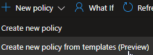
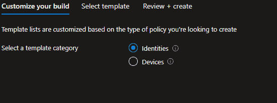
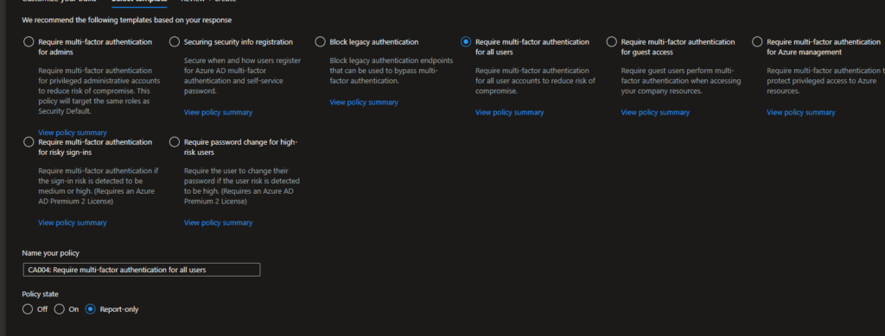
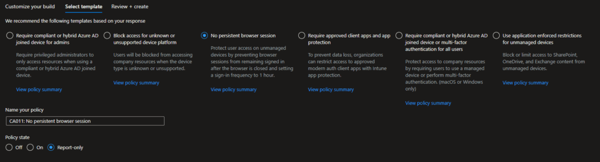

One of the bigger challenges with Conditional Access is baselining your security templates. As Microsoft so eloquently put it, [Identity is the New Battleground](https://domkirby.com/blog/microsofts-cyber-signals-identity-is-the-new-battleground/), so we **must** set baselines everywhere. After much waiting, Microsoft is rolling out templatized, best practices best Conditional Access templates. Let's check it out!

As you can see, it's quite easy to access templates. The New policy button is now a dropdown, from which you can choose to create a policy from templates. From there, just identify what sort of template you're looking to make.

## User Templates

This is where you'll want to go **first**. User templates provide a whole library of templates built to protect authentication for your people:

Whether you're looking to enforce multi-factor, turn off legacy authentication (you really need to do this), or set guidelines around MFA enrollment, these templates have you covered. Personally, I'd start with require MFA for all users and block legacy authentication, and go forward from there.

## Device Templates

Device based security is where Conditional Access **really** starts to shine.

First thing's first, get rid of persistent browser sessions! As you grow and implement Endpoint Manager with your customers, move on to requiring compliance for access. You can also require app enforced restrictions (MAM), which is a [critical step](https://domkirby.com/blog/security-baby-steps-mobile-app-management/) to protecting data on BYO devices.

 

Microsoft is putting a ton of work into simplifying the deployment of best practices protection measures for your environments, and I **really** look forward to seeing this come to fruition. From [universal MFA](https://domkirby.com/blog/microsoft-google-and-apple-agree-on-passwordless/), to templatized security options, security and convenience are finally closing their gap.
