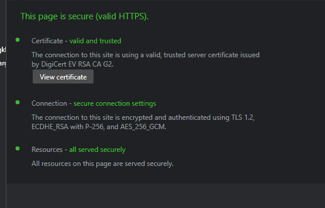

Now that the new normal is work from anywhere, we've got a major limitation on our hands: network protection. We can solve some of this with DNS filtering, which does indeed do an excellent job at web reputation protection. After all, the majority of the world's requests need a DNS transaction to find their web home. However, DNS filtering doesn't cover the totality of network traffic coming to and from your endpoints, especially on untrusted networks. This is where SASE, or Secure Access Service Edge, really shines.

With a SASE service, you can bring UTM like functionality (but so much more powerful) directly to your endpoints, at scale. With SASE deployed, the physical location of a network no longer matters, the network is homed in the cloud and data is routed encrypted through that (much like a VPN, but again at scale). Looking at the diagram above, I've illustrated that it solves the most obvious of challenges: **rogue Wi-Fi adversary-in-the-middle attacks**.

It's an attack as old as coffee shops: squat the coffee shop with a rogue AP and nab up all the traffic. This attack is less efficacious than it used to be with the advent of virtually universal encryption online. However, we still must consider the following:

- **Users ignore certificate warnings!** It's a behavior we've taught over the years, sadly. Many users will simply ignore a certificate error, allowing a successful AITM attack on themselves despite the encryption. With many sites still not leveraging HSTS, this is a real problem.
- **Metadata**. Okay so perhaps I can't read the data, but I can read a lot. TLS 1.3 is solving for this as it rolls out, but it still isn't everywhere. Without TLS 1.3, I can get important data like what services you're using. This is all intelligence I can use to tailor an attack.

\[caption id="attachment\_1136" align="aligncenter" width="556"\] TLS 1.2 being used by a major banking website in the US.\[/caption\]

## SASE Helps By Tunneling Traffic

First and foremost, SASE helps by encapsulating your traffic in an encrypted tunnel. Much like you would see with a VPN, but it does this with all traffic leaving the endpoint. If all traffic leaving my endpoint is doing do by way of a trusted, encrypted network, I've essentially eliminated the rogue network problem. If I choose a provider that can do this at scale and has a solid network, I do it with little to no impact to the users.

## SASE Also Delivers Firewall as a Service

You read that right. Good, modern SASE providers bring network firewall like functionality down to the endpoint. I can do web reputation filtering at the request layer, deep packet inspection, IPS, and all of those goodies. All of that without having to manage some piece of hardware somewhere, likely on a much smaller backbone that isn't distributed to be close to your endpoints.

## SASE vs Your Old Firewall

Another solution that is popular amongst big enterprise and within the defense base is rolling your own edge. Essentially, you put a firewall on an extensive network and use its VPN option. This is a very viable option, assuming you have a massive backbone to support all of your users at once. Big enterprises will also distribute this service to create edge nodes closest to their users, because they have those resources. I would argue that, for the most part, a SASE provider is the way to go.

## Products to Consider

There are a few different products out there. By far the most channel friendly I've seen is [**NordLayer**](https://domk.pro/KB7T1G). NordLayer is a spin off from Nord VPN, but focused for business. They offer an extensive feature-set that includes dedicated nodes that you can connect to your on-premises infrastructure. I'm working on testing this one, and I'll post an update once I get a good feel for it.

Another amazing product, and one I use today, is [Cloudflare One](https://domk.pro/NdqkPD). Cloudflare One is SSO by design, built on Cloudflare's massive network, and offers a lot of the features I spoke about such as web reputation filtering. They also offer device posturing, which enables you to do things such as ensure a device is encrypted, or that your EPP is running as expected. What's more, if you're running your own IT internally, it's an excellent product if you're under 50 users (as it's free!).
