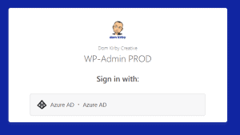

\[et\_pb\_section fb\_built="1" admin\_label="section" \_builder\_version="3.22" global\_colors\_info="{}"\]\[et\_pb\_row admin\_label="row" \_builder\_version="3.25" background\_size="initial" background\_position="top\_left" background\_repeat="repeat" global\_colors\_info="{}"\]\[et\_pb\_column type="4\_4" \_builder\_version="3.25" custom\_padding="|||" global\_colors\_info="{}" custom\_padding\_\_hover="|||"\]\[et\_pb\_text \_builder\_version="4.14.6" \_module\_preset="default" global\_colors\_info="{}"\]

In the spirit of moving my website back to WordPress, I thought I'd share some tips on how I personally secure it. This may or may not work for you,  but I've found that these strategies have worked for me for some time, I haven't had a case of compromise in quite some time.

Before we dive into the specifics of how I secure this site in particular (with a little OPSEC preservation), let me share with you the basic architecture.

\[/et\_pb\_text\]\[et\_pb\_image src="https://domkirby.com/wp-content/uploads/2022/01/wp-site-architecture-diagram.png" title\_text="wp-site-architecture-diagram" show\_in\_lightbox="on" align="center" \_builder\_version="4.14.6" \_module\_preset="default" border\_radii="on|30px|30px|30px|30px" box\_shadow\_style="preset1" global\_colors\_info="{}"\]\[/et\_pb\_image\]\[et\_pb\_text \_builder\_version="4.14.6" \_module\_preset="default" global\_colors\_info="{}"\]

This is the simplified rundown of my architecture. I'm running this site on a small VPS hosted on Digital Ocean. If you're interested in detail, it's using OpenLiteSpeed (for its caching magic) as a web server. It runs Ubuntu and I manage patching and performance with Canonical Landscape. As I would hope you guessed, each of my accounts on the services have MFA and the like.

- Origin server on Digital Ocean is proxied by Cloudflare which provides huge benefits.
    - **CDN**. CDN provides a huge performance gain. Static images are served to you from a cache instead of called from the server, reducing server load. The same applies to cached WP pages that don't change often.
    - **WAF.** Adding Cloudflare in the middle of your traffic pattern, and doing nothing to customize it, adds a lot of security in and of itself with its bot detection and reputation-based security. I've added some firewall rules I'll share later on.
    - **Access Gateway**. I'll get into this later.

## Breaking open the layers

Now that you understand the architecture, let's dive into what's built in each layer.

### WordPress and Core OS

Any WordPress configs are of course applied to WP itself, on the origin. Here are a few key tips I've found helpful:

- **Use MFA.** I'll preach this forever an always, Get yourself a reputable MFA plugin.
- **Only use necessary plugins**. This is where people get screwed. Only run the plugins you absolutely need and make sure they are being maintained and updated. The same goes for themes. Don't go installing 27 plugins you don't need to try to accomplish one animation. Do your research and test things. It pays off from both a security and performance standpoint. I run [Divi](https://domk.pro/divi) (my theme), a child theme for some custom work, [Monarch](https://domk.pro/monarchplugin) for social sharing, an MFA plugin, Wordfence, and that's about it. If I need to add a plugin, I'll research and test in dev first.
- **Run [Wordfence](https://www.wordfence.com/).** I'm a huge fan of Wordfence and the value that it brings to the table. Even the free version goes a long way in preventing attacks with their threat feed approach.
- **Update**. My server backs up daily, so I enable automatic updates. If something goes wrong, I can always roll back and evaluate.
- **Managed Compute Environment**. For most people, I recommend running your WordPress site on a reputable shared hosting service. I use a VPS because I'm a bit of a nerd and know how to manage it. I use Canonical's Landscape offering (super cheap on a small scale) to manage patching and performance across my Ubuntu VMs.
- **VPS Specific: Lockdown the network.** If you're running a VPS, make sure you know what you're doing. That said, here are the basics i do at the vnet level:  
    - Block SSH (I unblock it when I need it at my current IP)
    - Limit HTTP/S - Because I use Cloudflare at the edge, only Cloudflare needs HTTP visibility directly into the server.

\[/et\_pb\_text\]\[et\_pb\_text \_builder\_version="4.14.6" \_module\_preset="default" hover\_enabled="0" sticky\_enabled="0"\]

### At the Edge with Cloudflare

Okay this is where the magic really happens! It's worth noting that I've been using Cloudflare for a really long time and have never had a real issue with them. Everything I describe here is done on the free plan. Like I hinted at before, simply signing up for Cloudflare free and moving your DNS will add a lot of protection out of the box. You'll have bot protection, [DDoS protection](https://techcrunch.com/2021/11/15/cloudflare-terabits-ddos-attack/#:~:text=Cloudflare%20says%20it%20has%20blocked,of%20the%20largest%20ever%20recorded.), a caching CDN for performance, and more. All that said, I've taken advantage of some other free features that add to the mix.

\[/et\_pb\_text\]\[/et\_pb\_column\]\[/et\_pb\_row\]\[et\_pb\_row \_builder\_version="4.14.6" \_module\_preset="default" column\_structure="1\_2,1\_2"\]\[et\_pb\_column \_builder\_version="4.14.6" \_module\_preset="default" type="1\_2"\]\[et\_pb\_toggle \_builder\_version="4.14.6" \_module\_preset="default" title="Free Firewall Rules" hover\_enabled="0" sticky\_enabled="0"\]

I'll leave you to do your own research on configuring these, but there are the custom firewall rules I run:

- Block xmlrpc.php requests from anywhere. XML-RPC is old school and you very likely don't need it. Instead of fiddling with another plugin or tweaking system files, I simply block it at the edge.
- Block wp-admin and wp-login outside my home country. WordPress is famous for being attacked by script kiddies, simply blocking foreign countries from pinging wp-admin helps quite a bit, with performance if nothing else. I get 100's of log entries a day on hits to that from all over the world.

\[/et\_pb\_toggle\]\[/et\_pb\_column\]\[et\_pb\_column \_builder\_version="4.14.6" \_module\_preset="default" type="1\_2"\]\[et\_pb\_toggle \_builder\_version="4.14.6" \_module\_preset="default" title="Cloudflare for Teams/Access" hover\_enabled="0" sticky\_enabled="0"\]

Cloudflare for Teams is free for up to 50 users. I use it to provide content security on my personal devices and set policies on my kiddos' devices. They also have a really cool feature called Cloudflare Access. Because Cloudflare sits between users and the server, it's in the perfect spot to provide an access gateway.

Like I mentioned in the firewall rules, I block access to wp-admin from countries outside the US. Beyond that, requests to wp-admin require authentication at the edge, which is tied in with my personal Azure Active Directory tenant. You can see this functionality in action by trying to go to my [wp-admin](https://domkirby.com/wp-admin) directory.

\[/et\_pb\_toggle\]\[/et\_pb\_column\]\[/et\_pb\_row\]\[et\_pb\_row \_builder\_version="4.14.6" \_module\_preset="default"\]\[et\_pb\_column \_builder\_version="4.14.6" \_module\_preset="default" type="4\_4"\]\[et\_pb\_text \_builder\_version="4.14.6" \_module\_preset="default" hover\_enabled="0" sticky\_enabled="0"\]

In conclusion, I strongly recommend that if you run WordPress, you take extra steps to protect it!

\[/et\_pb\_text\]\[/et\_pb\_column\]\[/et\_pb\_row\]\[/et\_pb\_section\]
