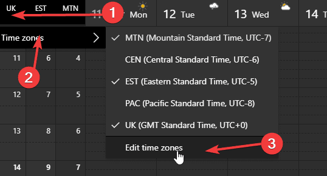
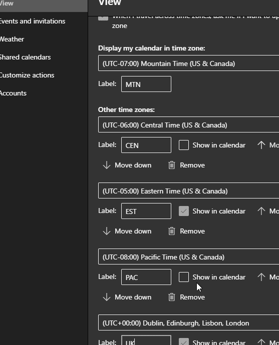

If you're anything like me, it's common for you to book calls with folks across time zones. I frequently find myself booking calls with folks all over the country, and now that Pax8 is international, all over the world! I've become good at translating US time zones on the fly, but worldwide time zones always get me. **That's why I was so excited when I discovered this feature in Outlook on the Web!**

## Multiple Time Zones on Your Calendar

That's right, Outlook on the Web allows you to display time zones in multiple columns on your calendar. I now have a "heads up display" of key time zones and can see my appointments in all of those time zones at the same time. Here's how you turn it on:

- Go to your calendar view in Outlook on the Web
- Click on the top left corner, above the time slots displayed on your calendar 
- Add the time zones that you want to see, you can add multiple time zones and select which ones are visible in your calendar using the previous menu 
- That's all there is to it, you now have multiple time zones on your calendar!

 

I hope this is as great as a discovery for some others as it was for me.
