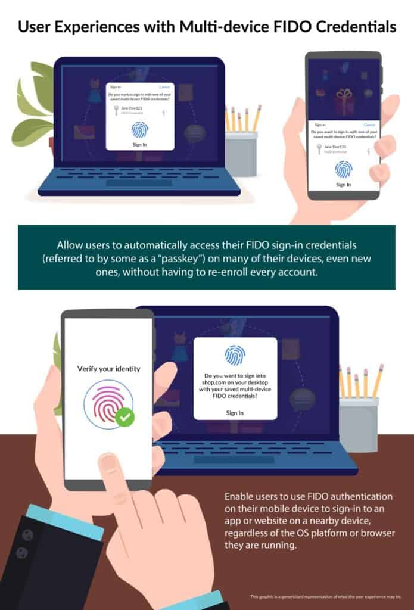

I never envisioned myself writing about these three companies agreeing, but here we are. And the news is **fantastic**. I've long been a proponent of passwordless authentication flows, which is really just a buzzword for relying on different factors such as biometrics and physical devices.

On May 5th (world password day), Microsoft, Google, and Apple issues a joint kill shot to passwords. They [announced](https://fidoalliance.org/apple-google-and-microsoft-commit-to-expanded-support-for-fido-standard-to-accelerate-availability-of-passwordless-sign-ins/), in coordination with the FIDO Alliance, they they've committed to building passwordless sign-in across all of the mobile, desktop, and browser platforms under their umbrella in the coming year. In a nutshell, passwordless authentication is coming to all major platforms soon (Android, iOS, Chrome, Edge, Safari, Windows, and macOS).

> “Just as we design our products to be intuitive and capable, we also design them to be private and secure,” said Kurt Knight, senior director of platform product marketing at Apple. “Working with the industry to establish new, more secure sign-in methods that offer better protection and eliminate the vulnerabilities of passwords is central to our commitment to building products that offer maximum security and a transparent user experience — all with the goal of keeping users’ personal information safe.”

This new FIDO based passwordless login experience allows users to choose their phone as the main authentication device across apps, websites, and other digital services as detailed by Google in a [blog post](https://blog.google/technology/safety-security/one-step-closer-to-a-passwordless-future/).

## Solving Two Difficult Challenges

This alliance solves two key challenges.

### Passwords Suck!

It's just true, passwords suck.

<blockquote class="twitter-tweet">
We're joining with <a href="https://twitter.com/FIDOAlliance?ref_src=twsrc%5Etfw">@FIDOAlliance</a> partners to help replace traditional passwords with unphishable passkeys that can be used across devices. Read more: <a href="https://t.co/RN2SeVe31m">https://t.co/RN2SeVe31m</a> <a href="https://twitter.com/hashtag/Passwordless?src=hash&amp;ref_src=twsrc%5Etfw">#Passwordless</a> <a href="https://t.co/1Rdwxr9RCv">pic.twitter.com/1Rdwxr9RCv</a>
— Microsoft Security (@msftsecurity) <a href="https://twitter.com/msftsecurity/status/1525162710488473600?ref_src=twsrc%5Etfw">May 13, 2022</a></blockquote>

According to Microsoft, password attacks are up 50% since last year. Users are notoriously bad at using passwords securely, password manager or not. Removing password from the equation - and replacing them with easy-to-use cryptographic credentials - is a **major** win for security. You can't really phish a signed nonce.

### FIDO can be tricky to use...

I'm an avid consumer of FIDO authentication. I carry two keys with me all the time (for two different sets of identities), and have backups locked up in a safe. Even as an avid user, I find myself sometimes inconvenienced by it. For example, sometimes I'm on a call and need to authenticate. DAMN, left my keys on the hook, and I need to get my Yubikey. For less experienced users, it takes some time to get used to the whole process.

\[caption id="attachment\_1081" align="aligncenter" width="695"\] Image: FIDO Alliance\[/caption\]

With this new experience, pictured above, users can rely on their phone as a factor. The factor is transferable too, meaning that getting a new phone doesn't cause pain like it can today with TOTP based authentication.

 

Microsoft, Google, and Apple have all said that they expect to roll out these new capabilities in the next year. We've been trying to [kill passwords](https://www.theverge.com/2014/4/15/5613704/the-plot-to-kill-the-password) for years, but this one feels like it might succeed!
