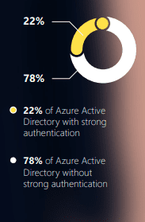
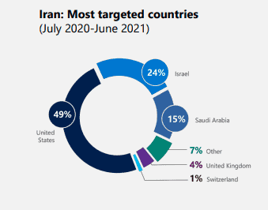
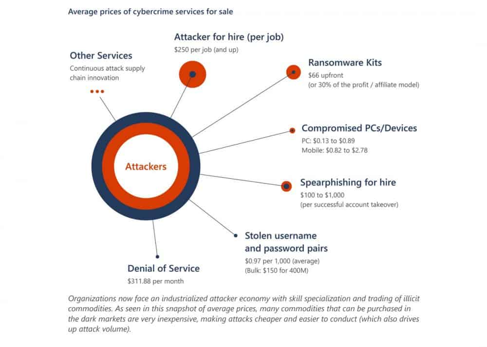
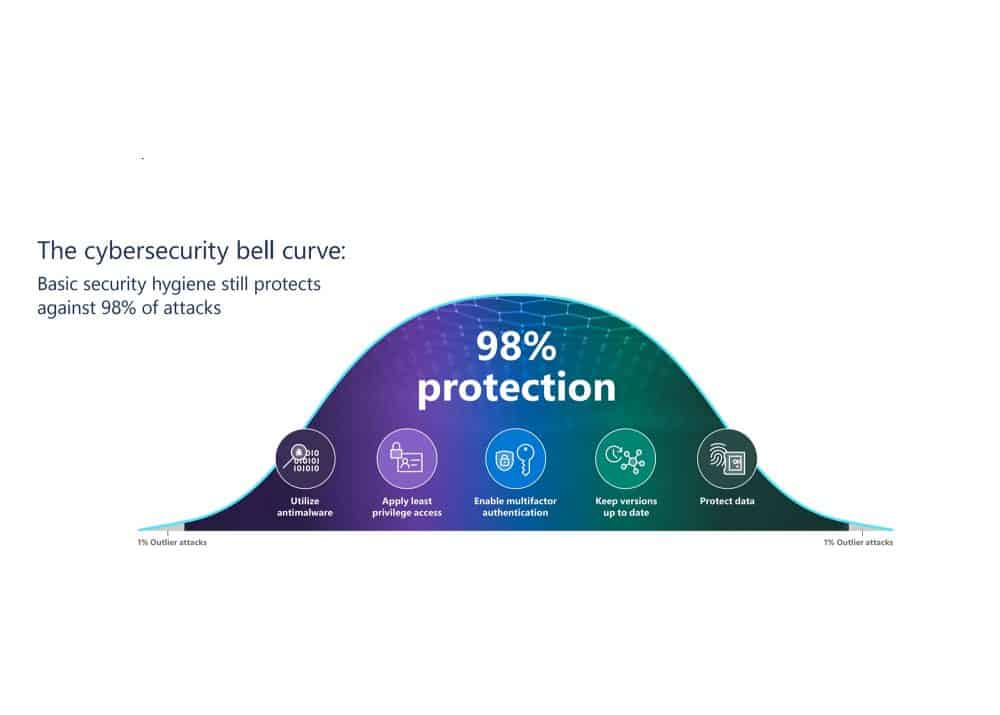

Microsoft is one of the most powerful, intelligent cybersecurity firms on the planet. Many people don't realize just how much intelligence Microsoft has at their disposal. In their new intelligence brief series, [_Cyber Signals_](https://domk.pro/MZBC2j), Microsoft is pulling back the curtain and sharing what they're seeing. It's an enlightening read to say the least, but this edition really spoke to what a lot of us already knew.

## Key Theme One: Your Identities are Vulnerable

\[caption id="attachment\_713" align="alignleft" width="183"\] Image: Microsoft Cyber Signals Ep. 1\[/caption\]

If you hadn't guessed it from the cover, the theme of this brief is **identity**. They cite that between November 26th and December 31st, 2021, Microsoft say **eighty-three million identity related attacks**. Adding to the problem is a **massive gap** between the sheer scale of identity attacks vs preparedness for those attacks.

> Dangerous mismatch in scale of identity-focused attacks vs. preparedness

What we're really saying here is that organizations **are not taking the proper steps to shield the identity layer from inevitable attacks**. The lack of Azure Active Directory accounts with strong authentication speaks for itself, this is an issue that **must** be addressed, and it must be addressed **right now**.

My call to action for **everyone** is to take basic steps right this minute. Seriously, switch tabs and turn on MFA, and come back. This includes your personal accounts such as your Google account or personal Microsoft account.

 

## Security Snapshot: Key Stats from 2021

This might be my favorite part of this brief. It shows the tremendous data Microsoft can leverage in protecting your data. It also gives you, the consumer, a better idea of the sheer amount of cyber danger they handle every day.

- **Endpoint threats:** Defender for Endpoint blocked more than _9.6 billion_ malware threats across consumer and enterprise devices
- **E-mail threats:** Defender for Office 365 blocked more than _35.7 billion_ phishing or otherwise malicious messages (across consumer and enterprise accounts)
- **Identity threats:** AAD identified and blocked over _25.6 billion_ credential hijacking attempts via brute forcing stolen passwords (on enterprise identities)

In summary, the sheer number of attacks and threats Microsoft counters is staggering. Each one of these attacks contributes to the data that Microsoft can use to make the Security Graph smarter, more efficacious, and more agile.

## Key Point Two: Nation-state actors are doubling down (again)

This should come as no surprise to most, but nation-state level actors are redoubling efforts to steal the building blocks of your identity.

> Cyberattacks by nation-state actors are on the rise. Despite their vast resources, the adversaries often rely on simple tactics to steal easily guessed passwords.

I find this quote interesting, as it states a crucial point. Many nation-state attacks aren't coming out of sophisticated zero-day high speed mechanisms. They're just spear-phishing and password spraying.

> If user credentials are poorly managed or left vulnerable without crucial safeguards like **multi-factor authentication** (MFA) and **passwordless features**, nation-states will keep using the same simple tactics.

I feel like we've been talking about this for an unreasonable amount of time. Report after report shows that simple safeguards can create enough protection to put you ahead of the bell curve (more on that in a moment).

> The need to enforce MFA adoption or go passwordless cannot be overstated...

Back to the point on nation-states. Microsoft goes on to cite that credential abuse is a key tactic of NOBELIUM (a group linked to Russia). However, they aren't along. Other adversaries such as Iran's DEV0343 leverage password spraying. Microsoft has observed DEV-0343 attacking defense companies including those that manufacture and work on radar, drone tech, satellite platforms, and emergency response platforms (think E911). Critical infrastructure and defense are the two key sectors nation-states want to own.

This report even goes on to reveal that this same group has been observed targeting regional ports of entry as well as maritime and cargo companies, focused on the Middle East.

\[caption id="attachment\_718" align="aligncenter" width="339"\] Image: Microsoft\[/caption\]

## Key Point Three: Ransomware owns the talking point, but only a few strains dominate the market

If you read or watch the news, the dominating narrative is that there is this "massive number of novel ransomware threats." Microsoft's research seems to show differently. The perception that the popular ransomware groups are huge monolithic organizations is simply untrue.

> What exists is a cyber-criminal economy where different players in commoditized attack chains make deliberate choices.

The model is simple. Maximize profit based on methods used to exploit information to which they have access to. The graphic below illustrates how different levels in this economy can profit from different attack kill chains. It also illustrates just how inexpensive it can be to outsource your dirty work.

\[caption id="attachment\_720" align="aligncenter" width="1000"\] Image: Microsoft\[/caption\]

To me, it's just fascinating. It's a parallel universe sort of economy. Actors will barter and sell services and tools to each other to get the job done. They make analytical decisions and strategize just like you do when running your business.

In summarizing, Microsoft makes a point I totally agree with. Regardless of the amount of ransomware, or which strains we're dealing with, key entrance vectors have been identified:

- Remote Desktop brute forcing
- Internet facing systems with vulnerabilities (check out [Matt's Unifi article](https://cybermattlee.com/blog/cis7-log4j-unifi/))
- Phishing

You can reduce risk on **all** these vectors with proper identity security, identity management, and **patching**.

> A type of ransomware can only become prolific when it gains access to credentials and the ability to spread. From there, even if it is a known strain, it can do a lot of damage.

## Takeaways and Action Items

Microsoft has done a fantastic job outlining what their data shows. I'm super excited to see future iterations of this brief. Be sure to grab it for yourself [here](https://domk.pro/MZBC2j). To wrap things up, let's review Microsoft's recommendations. I agree wholeheartedly with every one of them. Simple measures put you well within the bell curve of cybersecurity hygiene.

\[caption id="attachment\_723" align="aligncenter" width="1000"\] Image: Microsoft\[/caption\]

#### Really let it sink in, ransomware thrives on default or compromised credentials.

Ransomware isn't hitting your environment because of some super spy. They breached your account, plain and simple. Implement best practices like multi-factor or passwordless authentication.

#### Learn how to spot telltale signs of incidents, before it's too late

Strange logon activity, file movement, and a myriad of other behaviors are tell-tale signs of ransomware that can seem nondescript. You need to be monitoring and alerting anomalous activity. This is exactly why solutions such as **SOC as a service** have come to market.

#### Have a plan

Take the time right now to brush up your incident response plan. Identify what and where your data is and create restoration plans. Most importantly, run fire drills to make sure your restoration plan will work.

#### My own takeaway: follow a framework!

A reputable [cybersecurity framework](https://domkirby.com/blog/no-framework-can-mean-no-defensibility/) can help you address these points and more iteratively and strategically. Without it, you're flying blind.

This is not going to be a quiet year in cyber. It will be louder, and 2023 still louder. You **need** to be taking proactive measures from the boardroom down to put your organization in a position to survive.
