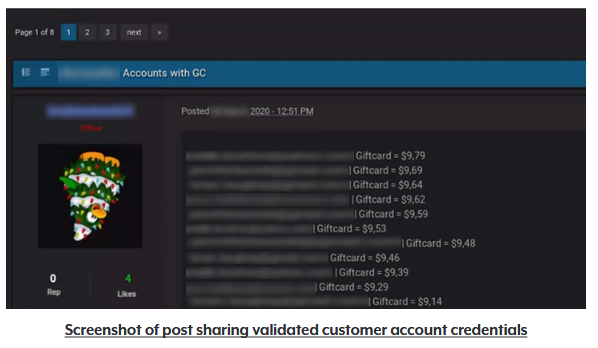

[THE RECORD](https://therecord.media/new-york-oag-monitors-hacking-forums-notifies-17-companies-of-security-breaches/) 5JAN22 - The New York Attorney General [announced](https://domk.pro/UC6ziE) Wednesday that it discovered over 1.1 million compromised online accounts resulting from an investigation into [credential stuffing](https://en.wikipedia.org/wiki/Credential_stuffing). According to the press release, the office found “thousands of posts that contained customer login credentials that attackers had tested in a credential stuffing attacked and confirmed could be used to access customer accounts at websites or on apps.” This investigation resulted in the OAG notifying 17 “well known” companies.

The impacts of this are yet to be seen, but I’m certain we’ll see more come out as time goes on and these entities begin to start a reaction.

> “The OAG also worked with the companies to determine how attackers had circumvented existing safeguards and provided recommendations for strengthening their data security programs to better secure customer accounts in the future,” AG James said.

The OAG also released a screenshot of accounts listed on these threat actor communities (censored for obvious reasons):

\>

<figcaption>

Image: New York Office of the Attorney General

</figcaption>

While we wait for details, I urge you to think of taking the following actions:

- Use a unique password for every identity you have, and use a password manager to keep track (I like [Bitwarden](https://domk.pro/bitwarden))
    
- Use two-factor-authentication **everywhere you can**
    
- Pay attention for news on recent breaches and take action including
    
    - Changing any creds that use the same password
        
    - Changing the impacted credentials
        
    - Raise your alert level for phishing and scams directed at contact methods saved on the breached platform
        
    - If any payment data is saved on those, consider rotating account numbers with your credit card issuer or bank
        

_Source/story inspiration:_ [_The Record_](https://therecord.media/new-york-oag-monitors-hacking-forums-notifies-17-companies-of-security-breaches/)
