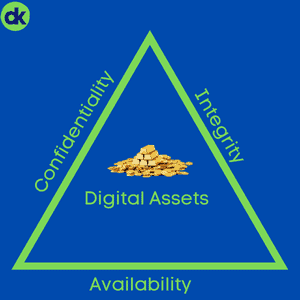

Frameworks are extremely important in the modern security landscape. With the level of complexity of today's average environment, even in the SMB arena, shooting from the hip is hardly an option anymore. In fact, I'd challenge that the way the SMB sector has approached security for well over a decade has just been plain wrong, let's dive in.

## The Shotgun Approach

This is the way many IT service providers (myself included at one point) have approached cybersecurity for a long time. We introduce a 'bag of tools' to the environment and call it good. Of course, 10 years ago, everything was in a walled garden protected by a firewall, it may very well have been enough. **However**, the landscape has changed. In the world of ransomware, [email compromise](https://domkirby.com/blog/business-email-compromise-is-still-alive-and-well/), and other smart shenanigans from threat actors, we need to up our game and be more strategic. Even more important is insurability. Nowadays, we insure the risk that having cyber assets and storing data brings to the table. For an insurer to be confident in our security, we need to take a methodic approach. Insurance underwriters are slowly getting better at this, and I fully expect them to require implementation and POAMs against a reputable cybersecurity framework.

The good news that comes out of all this is the fact that, in recent years, we've really simplified the definition of cybersecurity. On the flipside, it means the scope of a cybersecurity and/or practitioner has increased immensely.

> Cybersecurity, in a nutshell, is simply risk management by way of managing confidentiality, integrity, and availability.

## Being Defensible

With this drastic change in how we need to approach cyber comes a change in the way we need to talk about it. Like [Matt](https://cybermattlee.com) says frequently:

> "It isn't your job to protect your customer's infrastructure, it's your job to be defensible in _how_ you choose to do so."  -Matt Lee

At the end of the day, being defensible comes down to one key concept: **the reasonable person rule**. In a world where statutory and case law are both weak and hardly exist, we lean on the reasonable person rule. That means that other people (such as 12 of your peers in a trial) need to be able to find the choices you made in an effort to protect your client's digital assets _reasonable_. It's simple, right? If I can articulate, in lay terms, that I used reasonable measures and techniques that come from a framework developed by the cybersecurity community to protect the data and still lost, it sounds a lot better than "we threw some AV on there." Especially when talking to people with little to no knowledge on the topic!

## This is Where Frameworks Come In

The beauty of a framework is that it takes the guesswork out of reasonable action. Frameworks from a reputable organization such as the [Centers for Internet Security](https://www.cisecurity.org/controls/) or [NIST](https://www.nist.gov/cyberframework) are developed by teams of professionals, not just one person shooting from the hip. They're built off of years of real-world data and experience. In more specialized industries, there are even specific frameworks. For example, in the defense and federal spaces you have [CMMC](https://www.acq.osd.mil/cmmc/). Frameworks give us an exact list of things that we _must_ be paying attention to **and** give us an easy way to document our work, progress, and work to come ([POAM](https://csrc.nist.gov/glossary/term/poam)).

Personally, for the majority of work I do, I prefer to align with [CIS Controls](https://www.cisecurity.org/controls/). CIS controls offer a few key benefits:

- **They are prescriptive, but not too prescriptive.** They provide a really solid minimum bar for us to meet and give us the opportunity to build further.
- **They offer a maturity matrix.** CIS controls are broken into "Implementation Groups" where I can start with IG1 and work up to IG3 over time. This provides great opportunities to be iterative over time. I'd argue that a **minimum** goal for **every** business should be Implementation Group 1. You can easily build a defensible POAM that knocks out a certain control every quarter.
- **They have lower barrier to entry**. A huge swath of CIS IG1's technical controls can be covered simply by implementing technologies within Microsoft 365 Business Premium.
- **They offer a free CSAT tool**. CIS's CSAT tool is an amazing entry level tool you can use to track your progress, build POAMs, and upload your proof of work.

Of course, you're free to use whatever framework aligns with how you prefer to operate. They key is to pick a framework from a reputable, community driven source **and stick to it**. Build everything you do around it. Align your tools to the controls you pick, align your operations the same. And work with every client to meet the bars set forth in them. If you can achieve this goal in 2022, and have a POAM with some completed work for every environment you manage, your defensibility posture is going to be _automatically_ higher than it is today. When you can simply go into CSAT or a similar tool and show that you completed the technical work, documentation, and policy making for a specific control, defensibility gets much easier.

Furthermore, in the inevitable scenario where you encounter an incident or breach, you have documentation ready to go that can be presented to insurers, attorneys, law enforcement, and the litany of other parties that get involved in these sorts of things nowadays.

## Frameworks Are Not Everything

As much as I stress using a framework, it's only as good as the practitioner(s) putting them in place. That is to say, you need to start somewhere. In fact, you can suck at first, you're supposed to. It is very unlikely that you'll adopt a pristine environment that's in tip-top shape. That's just not realistic, and that's why we build POAMs so we can make iterative improvements. However, if you build a POAM that never gets done, you really haven't accomplished anything at all.

Today's cybersecurity landscape **demands** constant iteration and improvement. As a technology professional, your cybersecurity work is never done and there will always be new threats to tackle and new holes to plug.
