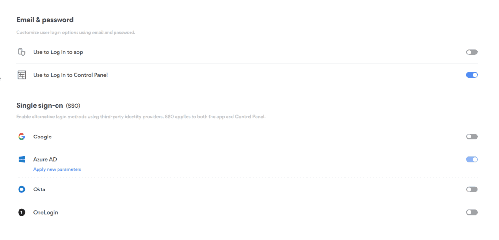
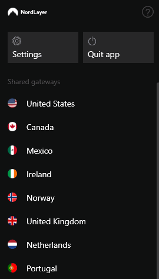

In July, Pax8 [announced](https://www.pax8.com/en-us/news-post/pax8-partners-with-nord-security-to-offer-online-privacy-and-security-at-a-global-scale/) a new partnership with [Nord Security](https://domk.pro/LqNNfq). I was particularly excited about this launch due to their [NordLayer](https://nordlayer.com) product and the promise of a simple to use SASE service with capabilities like single sign on, private gateways/servers and site to site VPNs. Once it launched, I decided to spin up an account for Dom Kirby Creative and give it a shot. I gotta say, I'm not disappointed in this product!

## Setting It Up

Once you've ordered NordLayer, it's pretty easy to setup. I love SSO, and Nord offers it on all of their plans (a nice break from the SSO Tax). So naturally, that's the first thing I did. It was a straightforward process aided by intuitive documentation. Before long, I had Azure AD-based authentication configured and ready to go.

Next, I poked around the different settings and into Security Configurations. I turned on their "ThreatBlock" feature which is just some simple reputation based filtering, but is a welcome addition, nonetheless. Now, I had only purchased the lower level license so I did not build a dedicated server. However, it is important to note that they **do offer** dedicated servers which can be used to have a private SASE edge with its own IP, and also create site-to-site tunnels for on-premise _or even cloud infrastructure_ 🍾.

I just want to reiterate that last point. You can use Nord **both as a SASE edge _and_ to enable secured VPN access to networks in Azure, AWS, and others!**

Satisfied with my work, I went ahead and installed the client on my machine and authenticated.

## Testing

As luck would have it, I had a Pax8 Bootcamp coming up during which time I'd be on sketchy hotel WiFi for a couple of days. I've been using Cloudflare SASE for some time but it was time to give Nord a shot.

### Connecting

This is as easy and intuitive as you'd hope it would be! Step 1: Click tray icon. Step 2: Choose gateway (I'm using shared gateways but you can make private gateways). Step 3: Use encrypted tunnel.

### Experience

I stayed connected to the US gateway during my entire time at the hotel. I had Teams calls, sent emails, downloaded files, worked in SharePoint, etc. Just normal work stuff. I didn't even notice an issue while using the VPN, things just worked as expected, with the speed I expected.

## In Summary

NordLayer is a very capable and powerful product in my testing so far. For simple, cloud-only businesses, it's a very easy product to implement. With just a little more work, you can add connections into your IaaS or on-premises environments, making it a powerful and multi-use tool.

I'm looking forward to testing this further and will provide more insights in the future.
