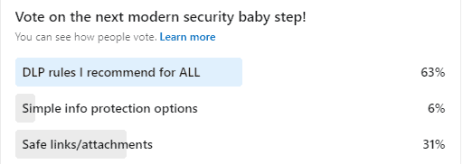

After my previous [**Modern Security Baby Step**](https://domkirby.com/blog/security-baby-steps-mobile-app-management/), I posted a poll on [LinkedIn](https://linkedin.com/in/dominickirby) so that **you** could decide the next topic! Surprisingly, you voted on Data Loss Prevention Rules I recommend for all!

So, let's talk about DLP! Data Loss Prevention is a simple concept. Hunt the environment for data within certain parameters, typically sensitive in nature, and act on it if someone tries to share it in a way that could create loss. Thus, preventing said loss.

Commentary on the post was pretty on point, how is DLP a baby step? And those folks are right. In general, DLP is considered a "more advanced" technology to implement. However, Microsoft has come a very long way in simplifying the DLP process! As a baby step, I look to implement DLP policies that work to reduce risks in electronic communications, mostly from a liability perspective. Here's what I recommend for every client:

- **Financial Data** It's never a good idea to email credit card numbers and the like. I always create policies that prevent external sending of financial data.
- **Country Appropriate PII** In the US, this is summed up with Social Security Numbers etc. This isn't stuff you should be emailing either.

The point is straightforward, create simple policies that cover data nobody should be emailing or otherwise sharing externally. As you get beyond baby steps, you'll refine your policy stack to cover compliance, trade secrets, etc.

**Check out the video below where we create basic DLP policies you can use at _every_ customer:**

<iframe title="YouTube video player" src="https://www.youtube-nocookie.com/embed/0XRPsms5QyU" width="560" height="315" frameborder="0" allowfullscreen="allowfullscreen"></iframe>
