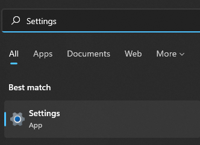
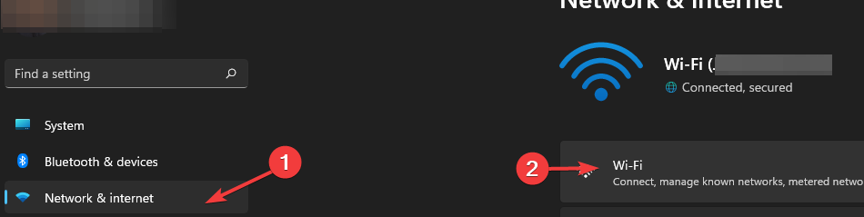
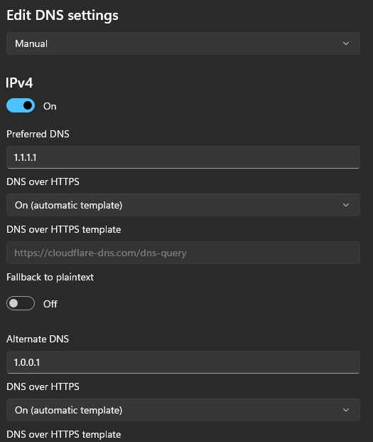

Did you know that Windows 11 ships with built in support for [DNS over HTTPS](https://en.wikipedia.org/wiki/DNS_over_HTTPS) (DoH)? DoH is both a privacy and security enhancement that allows you to _encrypt_ your DNS queries instead of send them in the clear over UDP. It uses HTTP/2 and HTTPS, and supports the wire format DNS response data, as returned in existing UDP responses, in an HTTPS payload. This accomplishes two things:

- Server assurance: Like any HTTPS connection, public key cryptography is in play. The DNS provider’s environment will present a trusted certificate, proving control of the environment, before a connection is completed.
    
- DNS Privacy: DNS is one of the number one ways a threat actor can start to ascertain your habits, especially on [untrusted networks](https://domkirby.com/blog/yes-public-wifi-is-still-insecure) but really anywhere in between you and your DNS service provider.
    

In this article, I’ll walk you through setting up DoH using [Cloudflare](https://1.1.1.1) (1.1.1.1,1.0.0.1) but you can use any provider of your choice that supports DoH.

## Setting up DNS over HTTPS

\>

<figcaption>

First, open settings. You can do this by click start and typing “Settings”

</figcaption>

\>

<figcaption>

On the left, go to “Network & internet” and click on Wi-Fi (or Ethernet if using a wired connection)

</figcaption>

\>

<figcaption>

Click “Hardware properties”

</figcaption>

\>

<figcaption>

Next to “DNS server assignment” click “Edit”

</figcaption>

Change “Automatic (DHCP)” to Manual and complete the fields as shown below:

\>

You’ll want to set the same settings under IPv6 as well!

That’s it! Your DNS queries will now be encrypted.

### Note on Falling Back

DNS over HTTPS can cause issues in some scenarios. For example, some captive portals will fail to function if they are not on updated technology. Turing on the “Fallback to plaintext” switch will allow Windows to fallback to a traditional, insecure DNS lookup. This may be necessary in some scenarios, but please note that it is hypothetically possible to _force_ your machine to fallback through certain methods as a form of attack.
