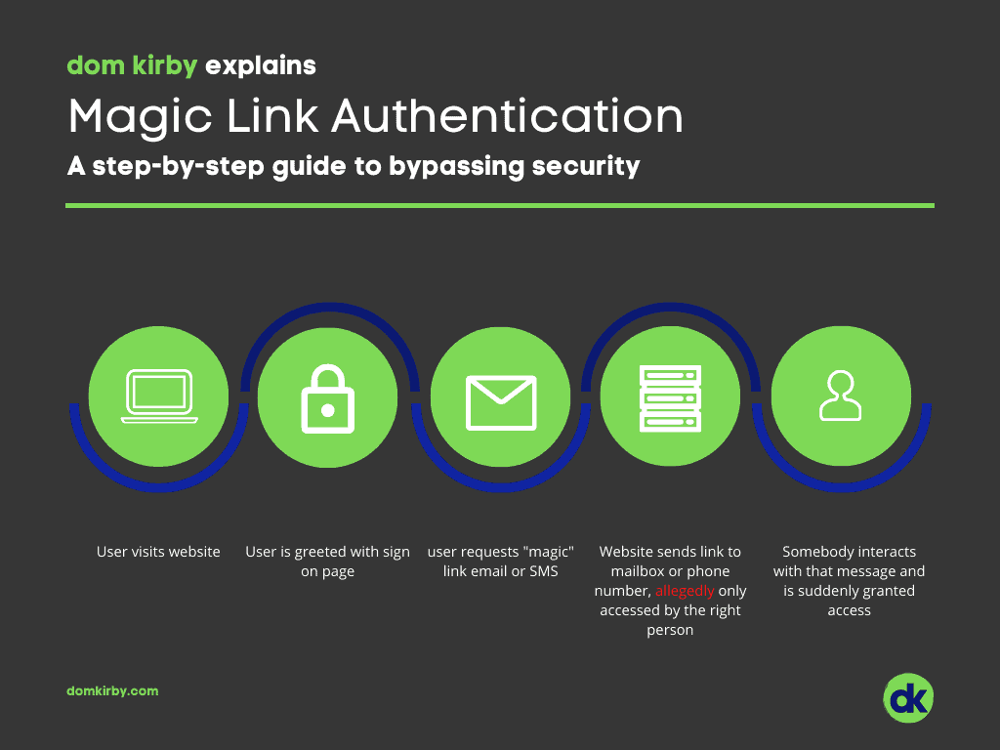

**Click here to get a link to** **login**. Magic links are suddenly everywhere, and I simply refuse to accept the logic behind them. Before I rant a bit about why you shouldn't be using them, let's talk through the basic concept behind it:

At a high level, magic link authentication seems **great** right. Everyone wants to say goodbye to those annoying darned passwords and be able to conveniently access things! Yay! **Here's the problem**, magic links **do not perform any authentication prior to allowing you into the environment.** That's a real problem!

**But Dom, the user has access to their email**. NO, somebody the service _assumes_ is the user has access to the email. The application itself does **nothing** to validate that the user is who they say they are, they rely on email provider. A provider where they have no control over how things are accessed. I could be using an MFAless POP email service for all the service knows. There's no authentication here, only identification.

 

## Do this instead

Stop being lazy! Implement actual authentication in a modern fashion that also brings convenience. OpenID Connect is one of the simpest ways to do it. This is typically what's going on when you see "Login with Google" or "Login with Microsoft" buttons. My point is that, if you're developing an app, it is your responsibility to **both** identify **and** authenticate the user. OpenID and other initiatives accomplish this quite well, and still eliminate the need to store hashses.
