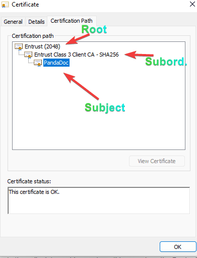

Following up on my last post about [certificate-based authenticatio](https://domkirby.com/blog/when-should-i-use-certificate-authentication/)n, I thought I would break down for the masses what a certificate is exactly. This isn't really meant for the super PKI nerds out there, so I'm going to simplify things plenty. I'm hoping to just help others understand what a cert is in the digital world.

## The General Concept

The general concept of a digital certificate is sparsely different from a physical certificate. The idea is that a certificate asserts things about a subject (person, piece of software, the server you're viewing this site on, etc.) in a verifiable fashion (with a signature). If you complete a college program, you earn a degree and are sent a certificate with your new qualification. It has your name, the degree you've received, and signatures of authorized people at the college (perhaps a seal too). These pieces together provide an initial vetting that you did indeed complete said college.

Once you have said degree, you're now the subject the college is issuing assurances for. If you present that certificate to a prospective employer, they become a **relying party**. As a relying party, it's on them to decide 1) do I trust this college to issue said credential and 2) does this certificate seem genuine. If the answer to those two questions is unanimously yes, they're going to accept that credential and take it into consideration for hiring decision purposes.

In the same token, perhaps your profession requires a license. The certificate from your college wasn't issues for the **purpose** of licensing you for that job, it just exists to demonstrate that you have indeed completed some educational program (perhaps related to said profession). Therefore, the **usage policy** of that certificate doesn't allow you to say you are licensed to do said job.

# Building Blocks

## Explicit Trust

As you may have gathered, that physical certificate relies on trust. You present your certificate to the **relying party** who is indeed **relying** on that college to give you a good education. The same is true in the digital world. The thing I'm using (typically an operating system) needs to **trust** that the issuer of your certificate has done the right thing to ensure that whatever they sign off on for your cert is indeed validated.

In the collegiate world, we rely on things such as the Dept. of Education to create that trust. In the world of publicly trusted certificates, we most often rely on the [CA/Browser Forum](https://cabforum.org/about-ev-ssl/) (also known as the CAB forum). The CAB Forum is basically a collection of industry humans that dictate the rules around how a **certificate authority1** can become **trusted** in the public. Check out their linked website if you wanna get nerdy.

Once the Dept of Education and other authorities have agreed that a collegiate program is good to go, their certificates are trusted. Once the CAB forum says that an organization (Let's Encrypt for example) is doing all the right things, they sign off on everything and browsers and operating systems will begin to **explicitly trust** that authority.

## Implicit Trust

If you check out the CAB Forum site, you'll see there are strict rules around authorities managing their secrets (private keys). Such regulation does not allow their root (the topmost certificate) to just sign things willy nilly. That's asking for key compromise, which has disastrous consequences. As such, they issue what we call subordinate certificate authorities. These's subordinates either issue further down subordinates **or** subject certificates themselves. At these levels, the explicitly trusted root has signed the subordinates and subject certificates, and your browser/operating system **implicitly trusts them** to sign certificates.

\[caption id="attachment\_1257" align="aligncenter" width="391"\] Trusted certificate chain\[/caption\]

## Trust in General

As you've likely gathered, this entire system relies on trust. It isn't without its pitfalls, but it's what we've got right now. In fact, some CA's have been "fired" (for lack of a better term) from the CAB Forum's approved list of CA's for issuing certificates in ways that break the rules. Google, Mozilla, Microsoft, Apple, and others can choose to make these decisions independently. But nonetheless, the explicit trust at the top is a gold mine, so there's major rules for protecting that.

**In private environments**, such as those for authenticating users, the CAB forum isn't going to put you on the list. Administrators will simply tell their own relying parties to trust certificates issued by your company's root and subordinates. The DoD and other federal government components do this extensively.

# Actual Certificates

So we've covered the building blocks of trust. Let's look at an actual digital certificate. The truth is these files aren't all that fancy. In fact, many certificate file formats are simply text files. Below is an example of a certificate issued to PandaDoc that they use for digitally signing their documents for non-repudiation purposes (expressed in a text format):

This is a text representation of what we call **x.509** format, and it has everything you need to know. Let's break it down:

- Certificate Version (certificates have changed over time, we're on the third iteration or x.509v3)
- Serial Number (every certificate needs a serial number maintained by its issuer)
- Signature Algorithm (how the data is hash and the has encrypted)
- Issuer (the authority)
- Subject (the actual person/thing receiving the certificate)
- Validity (issue date, expiration date)
- The Subject's public key (the shareable half of the [asymmetric encryption methodology](https://en.wikipedia.org/wiki/Public-key_cryptography) \[which is RSA in this case\])
- **Extensions**. Everything before is par for the course, basic info. Extensions are used for important things
    - Is this certificate an authority (can it sign off on other certificates)
    - Subject key and authority key identifiers (these help authorities check trust)
    - Authority Information Access (where can the robots go to learn more about this authority and subject)
    - CRL Distribution (where I go to check for revocation)
    - **Key usage** - this one is important. Take the licensing example, degree isn't license. In this case, the cert can't be used to TLS communications because it's only issued for **digital signature**. Applications should never trust this certificate to do anything outside of its key usage and extended key usage policies.
    - Extended key usage - added to support extra fancy stuff like smartcard logon, extended validation, and other uses
    - Certificate Policies - part of CAB forum requirements, publicly available documents that explain how the authority manages certificates
- The **signature**. Probably the most important field. It's basically a hash of the certificate file encrypted with the authorities **private key**. I can use the authority's **public key** to decrypt said hash and make sure it matches a computed hash of the certificate. This is where trust is established and asserted by the issuing authority.

That's it, that's all that goes into a certificate. **But**, unlike a physical certificate, a digitally signed certificate has key benefits. A [**digital signature**](https://en.wikipedia.org/wiki/Digital_signature)2 uses cryptography that should be uncrackable (at least for now). As such, I can verify that signature with a certain degree of safety. Other key benefits include:

- Revocability: Through the use of OCSP and certificate revocation lists, an authority can "take back" the trust they've assigned.
- Limited time: Certificates expire. This means that every so often (usually annually when it comes to server certs used for SSL), that trust has to be **re-established**.
- Independently Verifiable. Every relying party to a certificate can, on its own, make sure that the certificate is still good to go by verifying the digital signature and checking for revocation.

 

So, that's it. Certificates are simple, but the mechanisms for using them are complicated. There's books, wiki articles, and all kinds of material if you want to learn about key types, CA policies, certificate uses, OID's, etc. I just wanted to share, plain and simple, that a certificate is just a file signed by someone we trust. Much like a physical certificate.

 

1 - In the physical realm example, the certificate authority would be the college.

2 - Don't confuse digital and electronic signatures. A digital signature is cryptographically verifiable. An _electronic_ signature is simply a representation of your real world signature. E-signature providers often _digitally sign_ the documents you sign so that it can be proven that the document came from the product (such as PandaDoc) **and** that the content hasn't changed (non-repudiation).
