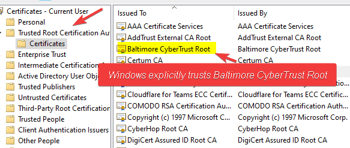

With Microsoft announcing [Certificate Based Auth general availability](https://domk.pro/yojDFt), it's a fair question. Certificate Authentication is nothing new, native support for CBA in Azure AD is very new, and it's very easy to setup. You simply trust your certificate authority with Azure and issue appropriately scoped certificates. I won't cover the technical bits in this post, but just the why.

## The Basics, Appropriate CA Administration

Standing up and managing a certificate authority is no small feat. The CA model, by its very nature, is one built on explicit and implicit trust. When you trust a root certificate, you're trusting all of the downline intermediate and entity certificates it's issuing. With that in mind, compromising the root or an intermediate CA has dramatic consequences. You can basically create trusted entities however you see fit, which is obviously an awfully bad thing.

With that in mind, here's what I would consider a bare minimum for operating a CA successfully:

- An **offline root**
    - The root CA is the topmost certificate of the certificate chain. For example, right now, the root certificate for the Cloudflare endpoint you're using on my site is Baltimore CyberTrust Root. This root is self-issued by DigiCert and is trusted by default in your browser because they've met very specific requirements. **Notably:** Baltimore CyberTrust Root isn't online. It's offline on an [HSM](https://en.wikipedia.org/wiki/Hardware_security_module). The private key is not remotely accessible, as this certificate rarely signs an intermediate CA. Typically, a whole "ceremony" with many trusted individuals is required to unlock it and open it. You can see a prime example of this in IANA's [quarterly key signing ceremony](https://youtu.be/YrV_P9xjHc8).
    - If your root is online, it's much easier to compromise. If I convince your root to issue me an intermediate CA, I can now issue certs that your infrastructure trusts. Not good. So, keep your root CA offline. You don't have to shell out $25,000 for an HSM, an offline laptop with key backups would suffice. It should _**NEVER**_ be online, **ever**. Some even remove WiFi cards and glue ethernet ports.
- An identity intermediate
    - This is the CA that issues things. You still need to **very carefully** control access to this, as the entity certificates under it will still be trusted. To meet this, you may consider signing an intermediate certificate in Windows ADCS with an offline OpenSSL based root CA (thus making issuance much easier)
- Documented policies
    - Written policies should exist for how the root signs new intermediates, requirements to be met before the intermediate may issue an entity certificate (device or user), etc. You can check out the NIST approach ([FIPS 201-3](https://csrc.nist.gov/publications/detail/fips/201/3/final)). NCSC in the UK also has some good [docs](https://www.ncsc.gov.uk/guidance/provisioning-and-securing-security-certificates).
    - These policies need to also cover validity period, identity proofing, revocation policies, revocation publishing, etc. It even needs to dictate who gets to do the issuing, what automation policies will be set forth, and so on.

Taking this into account, your certificate hierarchy may look something like this:

- Contoso Root Certificate Authority (offline; explicitly trusted by relying party)
    - Contoso Identity Authority (online, perhaps on Windows; explicitly or implicitly\* trusted by relying party)
        - Jimmy Smith <jim@example.com> (implicitly trusted by relying party)

Notice there's two levels of CA above Jimmy's cert. Note: this is oversimplified, there are many more fields to a certificate.

\*_Note: Depending on configurations, an RP may implicitly trust an intermediate because it's signed by the root or explicitly trust it by administrative configurations. Different systems do this differently, some provide flexibility._

**Other factors to consider include:**

- Root key size
- Subordinate key size requirements
- Entity key size requirements
- Key types (RSA or EC etc.)
- Validity Periods
- How are certs going to be enrolled?
- On what devices will user certs live (preferably a hardware token such as a YubiKey)
- Will we issue device certs for trust and network authentication?
- Should be break out a user CA and a device CA?

Point being, a properly built PKI infrastructure _should_ have more than just a quick CA stood up on Windows. It's also important to note that PKI as a Service is a thing. That said, I've only seen reputable companies launch enterprise-level services. I don't know that I'd trust a smaller name to properly manage my root keys.

### More notes on trust

This is a complicated topic, and there's a ton of other reading on this. But I just want to drive the point home that we're telling our relying party (AAD in this case) that they can trust anything signed by the root. It's like me saying "If Matt says that's me, that's me with 100% assurance."

Explicit trust is the reason your browser trusts the root of "Baltimore CyberTrust Root." They are part of the standard list of trust certificate authorities on Windows, Mac, Linux, etc. It is **explicitly** stored in the browser and/or operating system's certificate store. The Cloudflare Intermediate is signed by Baltimore, so trust for that CA is **implied** because the Baltimore root says the Cloudflare intermediate can be trusted. As a result, because the cert for _\*.domkirby.com_ is signed by Cloudflare, your browser **implicitly** trusts it.

\[caption id="attachment\_1249" align="aligncenter" width="583"\] Windows Explicitly Trusts Baltimore CyberTrust Root\[/caption\]

## So why would I use it?

Despite all that, PKI has its valid uses. There's a reason it's been a defacto standard in some places for decades. Let's evaluate.

- **Already Using It** If you've already built infrastructure for PKI, you may as well continue to take advantage of it. Most commonly, internal CAs in the corporate world are used to identify devices more so than users. In an 802.1x network, device certificates can be used to prove that a device belongs on a network. Extending into issuing user certificates for authenticating into cloud environments is a decision to consider, especially for your more sensitive workloads. This allows for certificates to be mapped back to both users and devices to authenticate to various relying parties.
- **S/MIME** **or Document Signing** In the Federal space in particular, certs are used to sign all the things. Documents are signed with a certificate, S/MIME is used for signed/encrypted email communications. If your organization is already doing this, and has a properly built PKI, extending this to user authentication could be a natural choice.
- **Meeting IAL/AAL requirements** Certificates have the benefit of storing information beyond just a username. There's a ton of fields you can take advantage of to present additional data, which can help with IAL and AAL requirements. NIST SP 800-63B3.3 (Assurance Level 3) show factor towards cryptographic authentication with a memorized secret (a smartcard/CAC). Further, information related to IAL3 (800-63A 2.2) can be stored. These fields also enable the huge amount of interoperability required in these environments. These may come issued in the form of an ECA cert (well beyond the scope of this article).
    
    \[caption id="attachment\_1250" align="aligncenter" width="380"\] Example of subject fields (given name, surname, etc) on a user cert.\[/caption\]
- **Interoperability** I already alluded to this one in the last bullet. The independent nature of certificate trust lets us do some pretty neat stuff. For example, my tenant is cloud only with no AD/AD Connect deployment. My CA is issued entirely separate of any other identity system, yet I can logon with my user cert. That's because the CA is in and of itself an entity, that I can tell AAD (or any other certificate based system I own) to trust for authentication purposes. Being able to pass key information like Given Name, organization, etc. allows a lot of flexibility for systems that can't integrate in a more traditional fashion. **The need for this is very rare in the SMB space but can be handy in some instances**. I wouldn't necessarily recommend it, but you could go so far as to assign trust to an ECA root to allow contractors to use an ECA token to login to Azure AD resources.

## Should I start from scratch?

For fun, sure! Test it out! However, if you haven't met one of the use cases above, I probably wouldn't. FIDO2 uses a similar cryptographic method but uses only explicit trust. Each public key is tied specifically to the user and explicitly trusted by the relying party, and there is no implicit trust anywhere in the system. The benefit here is that it's easy to setup (no CA to manage) and easy to revoke (just remove the key from the list). It also offers the same protection as a smart card type sign on with a PIN+key (PIN can be replaced with a biometric on some devices). FIDO2 and PKI also offer a basically identical level of phishing protection.
