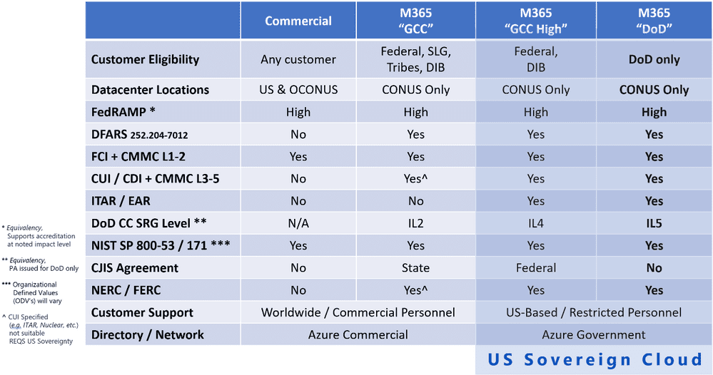

_**Disclaimer:** This article is based on my own opinions from reading [Understanding Compliance Between Commercial, Government and DoD Offerings](https://techcommunity.microsoft.com/t5/public-sector-blog/understanding-compliance-between-commercial-government-and-dod/ba-p/2157679) and should not be taken as perfect. You should consult your compliance counsel before making data storage decisions!_

If you're working with public sector customers, knowing where to put them from a compliance perspective can be a real pain. Especially when you're working with large & complicated vendors like Microsoft. The government is not good at making things simple, and a lot of decisions you need to make come down to stakeholders and enforcement bodies. I recently stumbled on [this Microsoft](https://techcommunity.microsoft.com/t5/public-sector-blog/understanding-compliance-between-commercial-government-and-dod/ba-p/2157679) post from way back in last February. This article does a great job laying it out. But, if you take anything away from my post, use this table from the Microsoft post:

\[caption id="attachment\_567" align="aligncenter" width="999"\] Image Credit: Microsoft\[/caption\]

It is one of the best graphics I've seen to help build a simple decision tree. On our first column, you can see just how many different categories of information need to be covered such as DFARS, CJIS, ITAR, CUI, FCI, data across DoD impact levels, et al. **This** is why it's so complicated. It's not just about "government data." It breaks down to Federal vs SLG, DoD vs other agencies, and different requirements within each. Making this even more fun, there are different enforcement categories. For example, the [State Dept. Directorate of Defense Trade Controls](https://www.pmddtc.state.gov/ddtc_public) enforces ITAR in the United States, and ITAR is an international treaty. CJIS rules are maintained by the FBI. Those are two different agencies that Microsoft needs to answer as they design their cloud.

## Complex Evaluations

When evaluating what cloud to leverage for your customer, take into consideration the fact that Microsoft 365 Commercial has a FedRAMP High ATO, you can stick a lot of data in there. A customer that does Government work that doesn't fall into any of the "No" categories in that column can work in Commercial. Perhaps it's Dunder Mifflin and they sell paper to some Federal agency, they're probably fine in commercial so long as they aren't dealing in DFARS, ITAR, CUI, IL2+, etc.

### Simplified Examples

Here are a few key examples that I frequently run into in discussions with partners and where _I think_ they could be hosted _in my opinion_:

- **State, Local or Tribal Government, _including_ a law enforcement agency (state patrol, city police, county sheriff etc.):** Microsoft 365 GCC (CJIS)
- **State, Local, or Tribal Government, _not including_ an LEA (uncommon) that does not deal in protected LEI:** Microsoft 365 Commercial _could_ work but there is a high chance of data creeping above the scope of commercial, so it's best to start them in GCC to avoid the pain of a tenant-to-tenant migration.
- **Private Entity with a Federal contract that does not deal in ITAR, DFARS, CUI, is not a member of the DIB (the Dunder Mifflin example):** Microsoft 365 Commercial
- **Private Entity with Defense contracts:** Microsoft 365 GCC High (ITAR and IL4+ must live in GCC High, substantial amounts of CUI require GCC High and it's likely your customer will break the GCC barrier in natural course of business)

 

I hope this quick summary helps you out, but please be sure to work with your customer and their compliance counsel to ensure that they are making the right data hosting decision.
