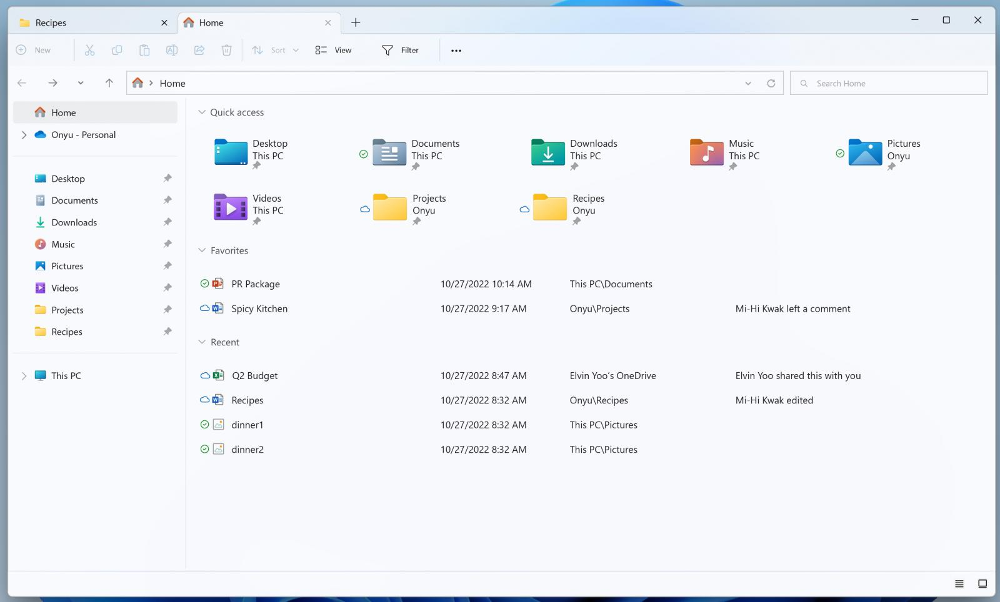
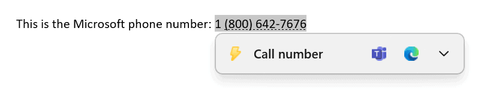
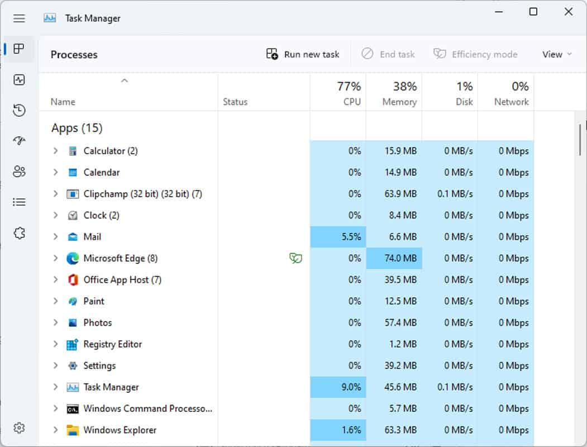

Windows 11 22H2 is here, and I think there are some features you should be aware of. These would also be some great noteworthy features to share with your prospects and customers.

## Key Feature Updates

### File Explorer

Explorer got a full-face life with a new start page (delivering quick access to favorites and recents). Sadly, the new tabbed UI **has not** yet made it to production but we're expecting that to come out in October.

### Smart App Control

This new security feature will block untrusted and/or unsigned applications. To use this feature, a clean install of Windows is required (i.e. upgrading from Windows 10 or a prior Windows 11 build will not open up this new functionality).

### Improved Windows Snapping

I gotta be honest, I wasn't sure snapping could get any better than it already is with Windows 11. But, alas, they've added some enhancement to this build:

- Improved touch navigation
- Snapping of multiple Edge tabs

### Suggested Copy Actions

Suggested Actions on Copy will automatically make suggestions based on what data you copy to the clipboard. For example, copying a phone number may prompt you to open up Microsoft Teams to call the number.

For me, this is a particularly powerful feature as it will help users be more efficient when interacting with their operating system.

### Taskbar

With 22H2, drag and drop is back, meaning you'll again be able to drag files onto opened apps in the taskbar to open them.

Taskbar overflow is also back for those of us that tend to open way too many programs. You'll see a small menu to the right to see the extra open apps and icons.

### Task Manager

Even the task manager got a refresh in 22H2 and is more aligned with FluentUI and WinUI. Task manager often finds itself being an afterthought, so it's nice to see an update being pushed in its direction.

 

There are certainly [some other new features](https://www.bleepingcomputer.com/news/microsoft/windows-11-22h2-is-released-here-are-the-new-features/) to get excited about, but I think these features are most likely to be leveraged by your business users. **Especially** Suggested Copy Actions!
