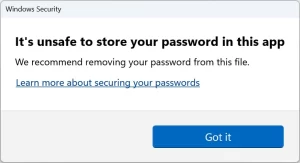

With the release of Windows 11 22H2, Microsoft has added Enhanced Phishing Protection to its operating system. This feature proactively warns users if they're putting their Windows password into an insecure application (such as Notepad or Word) or on websites.

Windows login credentials are extremely valuable to threat actors, are they can often be used to access corporate resources outside of the machine itself. Combine that with a staggering lack of multifactor authentication or proper access management, and you've got a recipe for disaster.

> "SmartScreen identifies and protects against corporate password entry on reported phishing sites or apps connecting to phishing sites, password reuse on any app or site, and passwords typed into Notepad, Wordpad, or Microsoft 365 apps," explains Microsoft Security Product Manager Sinclaire Hamilton. "IT admins can configure for which scenarios end users see warnings through CSP/MDM or Group Policy."

\[caption id="attachment\_1196" align="aligncenter" width="300"\] Alert displayed when entering a Windows password where you shouldn't.\[/caption\]

It's worth noting that, right now, this feature has some important limitations:

- It will not function when logging in with Windows Hello (but, Windows Hello is massively powerful for preventing cred theft)
- It is not enabled by default (check out [Bleeping Computer's guide](https://www.bleepingcomputer.com/news/microsoft/windows-11-now-warns-when-typing-your-password-in-notepad-websites/#:~:text=How%20to%20enable%20Enhanced%20Phishing%20Protection) on turning it on)

With those limitations in mind, it seems that this feature is primarily targeted at enterprise customers joined to traditional domains.
