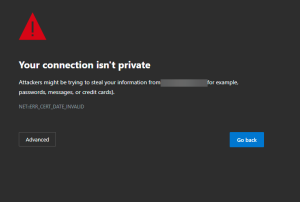

So, on my phone, I use [Microsoft Start](https://blogs.windows.com/windowsexperience/2021/09/07/the-content-you-care-about-simplified-and-reinvented-introducing-microsoft-start/) as a news feed. I know, ANOTHER Microsoft product, Dom? Yes, maybe I have a problem, but I like how it customizes my feed. Anywho, that isn’t the point of this article. No, this article is about a news piece I read a couple of weeks ago that’s been bouncing around in my head.

I won’t bother linking it here, partially because I won’t be able to find it again but also I don’t want to give it the backlink. In a nutshell, the headline was “It’s not dangerous to use Public WiFi anymore.” I thought, ‘oh man here we go, another news anchor reporting on something they have no business reporting on.’

This is where the story got shocking. **A local ‘cybersecurity expert’ had weighed in on this story**. He argued that, because HTTPS is now prolific on the internet, you can use public WiFi to your heart’s content without the ‘fear we used to put into people. ‘ In fact, the article went on to center around how that VPN service you’re buying is just a marketing gimmick (by the way, that’s true in cases of providers with no reputation). I was... awestruck. I didn’t quite know what to say or think. I decided to try to put it out of my mind. However, here I am, a few weeks later, still thinking on it. So I had to write.

## HTTPS is not the magic answer!

HTTP over TLS (HTTPS) goes a real long way in improving security. It (properly implemented) protects the actual information I send to a web server and vice versa. Great, grand, wonderful. Here’s the thing. **I can still get all the following intel:**

- What hosts you’re looking up (unless you’re using DNSoHTTPS)
    
- What servers you’re connecting to, over what protocol (metadata attacks)
    
- Other garbage your computer is doing in the background (telemetry, et al.)
    

At a very basic level, I can transparently steal your connection and learn a whole lot about you simply by what sites you’re visiting. If you’re connecting to 1.2.3.4 with TCP 443 over and over again, I can simply figure out what’s there. If it’s your company’s SSLVPN, I can start to enumerate that. If I see you all over Facebook, I can snap your photo, do a reverse image search, and figure out who you are and what you do. If you’re hitting 40.97.150.98 over and over again, you’re connecting to Exchange Online. I can start to tailor my next move.

**Which leads us to problem two, the world isn’t built of diligent cybersecurity practitioners**.

What percentage of users would you venture bypass these??

I’d venture that **most** do. I’d even put a buck on 70%. In fact, many users have been inadvertently **trained to ignore certificate errors**!!! If I drop a successful MITM attack (I still think my chances are good), I can decrypt your information anyways.

If you’re using your personal computer, there’s a decent chance your firewall configuration is a joke, and Windows isn’t hardened in any way whatsoever. I can probably just start to enumerate your device and find a way in, because you probably ignored those “please update me already” messages from your operating system.

That’s just a few of the things I can do, despite how common HTTPS is nowadays. My point is, we should still consider using VPNs and/or SASEs. We still **must** train people on the risks of using public WiFi. Do better, quit putting so much stock in improvements that don’t deserve the investment. By the way, check out [this shirt](https://domk.pro/THrFCY) for your next ‘casual visit’ to your favorite coffee joint.
