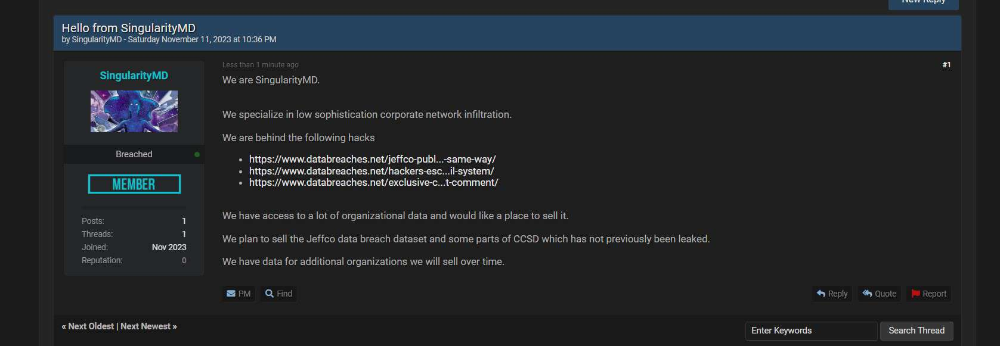

\[learn\_more caption="Important Preface - We are Human"\]

Before we dive in, I want to make something clear. Right now, there are a lot of incident responders dealing with these attacks on education. These people went to bed as defenders and woke up as incident responders. They're dealing with federal law enforcement, cyber consultants, forensics, and constant pressure to keep school going. Not to mention frustrated parents looking for information. And, the truth of the matter is, they aren't yet sure what happened. In any situation, these investigations are complicated.

Further, school districts have some of the most difficult set of circumstances when dealing in cybersecurity. They must operate on shoestring budgets, handle thousands of end-users (some of whom are five years old), and often oversee _massive_ networks that are filled with complicated components. They are also subject to a spider web of compliance requirements while being simultaneously expected to maintain near perfect reliability **and** maintain a widely open educational technology environment.

In all of this, remember the human element. These hard-working defenders are likely facing the hardest situation they have in their career. Sometimes I don't do a good job saying this, but I'm saying it now. **We see you. We empathize with you and understand your pain. You are not alone.**

\[/learn\_more\]

**UPDATE: 11/20/23 - Jeffco posts 11/17 Update**

On November 17, Jeffco posted another update to their website. As expected, it's more of a "here is what we know" post. Here's what they're saying:

- _The review of our Human Resources system, PeopleSoft, did not reveal signs of compromise to sensitive data such as staff banking information or social security numbers._  
- _Student ID numbers were accessed. However, these numbers are randomly generated and do not reflect anything identifiable related to students outside of their school record. Please note that Jeffco does not routinely collect parent/guardian and student social security numbers or National ID numbers._ 
- _Family banking information used to pay school fees is located in third party systems that have no indication of being accessed._
- _**Jeffco will follow all data breach requirements, including notification obligations, contained in Colorado law.**_ 

_Taken directly from_ _JeffcoPublicSchools.org__._

As one may expect, this is a huge investigation. School Districts of this caliber has a huge number of portals and platforms that will need investigating, and it seems like they are working them in order of risk (perhaps). PeopleSoft not showing signs of compromise is a valuable insight, as the HR system of a school district (like any HR system) contains vast amounts of personal data (**so possibly some good news here**). So far, they are noting that Student ID numbers were accessed. If the statement is accurate, and it's only student ID numbers, that would be a pretty minor data point. However, it is worth noting that student usernames are all based on the ID number (a student's username is their ID number). This would provide the basis for password sprays (which speaks to the need of strong student passwords and MFA).

## Here's what the intel says

It's important to note that threat actors can easily _claim_ they have more data than they do. As they Jeffco investigation pans out, it's also important to see what intelligence tells us. I've been working with [Matt](https://www.linkedin.com/in/cybermattlee/) to track this one. [According to DataBreaches.net](https://www.databreaches.net/times-up-singularitymd-sets-up-to-sell-data-from-jeffco-public-schools/),  SigularityMD are attempting to sell the data that was gathered. This is a common step in the process, and means they aren't yet going to release data.

\[caption id="attachment\_1574" align="aligncenter" width="1677"\] SingularityMD's post on Breach Forums - from DataBreaches.net\[/caption\]

> Attempting to sell data on the popular forum is somewhat of a game-changer, as even if they sell data to just one buyer, there is no way to know how many others will buy the data from the original purchaser. The buyer might keep it privately or choose to re-sell it to any number of buyers. Or if there’s no buyer, SingularityMD might just leak the data (give it away freely on the forum).

DataBreaches reached out to Singularity, confirming that their first goal is to sell the data:

> With the jeffco data we are attempting to sell it now to the highest bidder on breachforums among others. So it may take longer to appear in the public domain and may actually not be made public. **We will likely leak whatever we cannot sell.**

**At this stage**, this still amounts to a claim of data. We've yet to see any proof of what data was actually taken and may never unless we can get a solid forensic picture on the victim side.

* * *

## Original Post

**As this is a developing scenario, I've already made updates to this post. They are marked as such.**

**Fellow Parents:** Please feel free to read the whole thing, but also please be sure to check out the [for parents section](#parents).

Cybercriminal organizations have a very simple mission: to produce money. As the business landscape started cracking down on security, another victim had to take its place. A victim that has little resources and is often ridiculed when they ask for more resources. A victim that services the most difficult of end-users. This victim operates on a tiny cyber-budget, gets publicly chastised if they ask for more budget, but gets brutally ridiculed when they experience an incident.

## What's Happening?

Public school districts in the US are falling victim to a variety of cyber incidents. Ransomware is obviously on the list. However, something arguably more disturbing is on the table now. Last week on [The Game](https://www.youtube.com/watch?v=knst8pjJ5Ng), Matt and I covered news about a [school district in Nevada](https://www.bleepingcomputer.com/news/security/hackers-email-stolen-student-data-to-parents-of-nevada-school-district/?&web_view=true). This attack was interesting to us because there was no ransom or detonation component. Seemingly, the group SingularityMD simply stole data and went right to the extortion part, emailing parents of children about their kids' stolen data. Moreover, they resort to playing on American political challenges:

> "We asked for less than one third of the Jesus F Jara's annual salary in exchange for destroying the stolen data."

This, for me as a parent, is an alarming attack. One that threat actors expect to get results, because they are targeting children. They are targeting children, and then praying on parents who don't understand the anatomy of an incident. I would imagine that district is feeling pressure to pay.

## What's New?

When I said this is hitting close to home, I meant it. I feel comfortable sharing that my kids are in Jefferson County Schools (Jeffco; and have shared this before). Jeffco is one of the largest districts in my state, with hundreds of schools serving nearly 80,000 students across the state's largest metropolitan county. Four of those students are mine. While we were talking about the district in Nevada, an ongoing incident was occurring in my backyard, impacting my kids. Over the weekend, IT systems were brought down to apply forced password resets and likely to continue what would certainly be a significant forensic investigation.

### The Lay of the Land

Let's step back for a minute and think about the operating environment Jeffco has. They have almost 80,000 students and about 14,000 employees. Let's call it 94,000 'internal' end-users. Parents also have accounts on their systems. Let's assume (ignorantly) a 1:1 student to parent account ratio. So somewhere in the neighborhood of **174,000 identities**. Add in a wide area network across hundreds of sites. Now, add in a massive set of services: SIS, reporting platforms, SPED platforms, identity platforms, payroll/ERP platforms, financial platforms, likely some orchestration platforms, etc.

Now, imagine yourself managing all of that. Oh yeah, and a large portion of your end-users are kindergartners, they can't operate in a world with high complexity passwords and MFA.

### The Incident at Hand

\[box type="info"\] This is an ongoing incident with limited coverage. By the time you read this, material facts have likely changed. \[/box\]

Let's talk about what's unfolding. **Thankfully, Jeffco is being as transparent as they can, for which they receive my gratitude**. According to the district, this started to unfold on Halloween. Jeffco has provided numerous updates to parents and will likely continue to do so. See them all [**here**](https://www.jeffcopublicschools.org/about/communications/jeffco_news/Information_regarding_cybersecurity_incident). This incident is eerily like the Nevada incident, but **no confirmation has been provided and no threat actor has made claims (as of writing). UPDATE 11/7: Copied emails indicate that SingularityMD may be claiming credit for this (based on emails sent to parents).** I'm not going to get into every tidbit, read their updates for that. But here's the high-level overview in order:

- 11/1 Update: From the CIO indicating _"some Jeffco staff members received alarming email messages from an external cybersecurity threat actor"_ **Notably:** This communication is clear and to the point. Here's what's happening, here's what we're doing. Also, there's a critical piece of transparency here (one I would imagine came at the dismay of some law enforcement agencies): _"Our communication timeline will be informed by our law enforcement partners and cyber security experts to ensure the integrity of their investigation."_ Being honest that LE is going to set the pace of communications is important!
    - In response, they forced a credential reset for all staff accounts. Remember, that's some 14,000 users!
- 11/4 My Experience: Jeffco students became unable to access accounts over the weekend and were required to reset passwords. **This meant managing a password reset event for nearly 80,000 users, some of whom are five.** IT and teachers had to collaborate so students could resume school on Monday.
- 11/7 Update: From the CIO indicating that parents are now receiving messages, potentially from a threat actor, regarding stolen data.

At a high level, that's what I've seen. I would sum it up as brutally honest and genuinely helpful communication. In an incident like this, **you just don't know what is actually unfolding**. When you start to know, you have to limit what is shared to maintain the integrity of the investigation. Being honest that 1) you don't know the scope and 2) updates will come out as the investigation allows and 3) updates will not include information that compromises investigation is the best you can do in this situation.

\[learn\_more caption="UPDATE 11/7: SingularityMD Claims Incident"\]

Based on an email screenshot I received, SingularityMD is claiming the following stolen data:

- Staff phone, home addresses, title, and 'other details'
- Parent and student contact information (past and present) - 90,000 students
- Student school email addresses, emergency contacts name, phone and email, student birthdates, 90,000 students
- "Full backup of your IT project management directory
- Some financial documents
- Extracts from Group conversations _\[Additional information redacted by me\]_ > 2000 conversations and files
- Full extract of IEP's

_I will not be posting the full screenshot, I don't feel its necessary._

\[/learn\_more\]

\[box\] It must be said that Jeffco has not publicly confirmed that an incident or breach occurred. **Because they do not yet know what's happened**. \[/box\]

### My Initial Thoughts (For Practitioners)

I'm not looking to armchair quarterback here. But as an impacted party with an underlying knowledge of incident response... It seems like the district is taking sound steps to respond to this incident. Credential resets have happened (for some 100,000 users). Certain infrastructure has been taken down or has gone up and down, presumably for forensics. The district is communicating frequently and seemingly to the degree they can in the current state of the incident. Overall, with the very limited information in front of me, I'm seeing a sound response while reminding myself that the best laid plans become guidelines at best when the proverbial "shit hits the fan."

Obviously, I don't know the impact. I also don't know if some poor posture contributed to this (though I know in my heart it's likely). I'm not looking to throw shade right now, so I'm not digging into that.

## For Less Informed Parents

I'm writing this section for other parents who don't live in the cybersecurity world, especially other Jeffco parents. First off, less informed isn't an insult. I wouldn't expect everyone to understand what is happening, so I'd like to share some insight into living through an incident, as a cybersecurity practitioner.

First and foremost, I would ask that you not throw shade or cast blame. Could there be some critical mistake here? Sure, but it isn't time to go into that. The men and women charged with protecting your kids' data are experiencing enough pain right now. An incident like this is crippling. Not just in the sheer amount of work that must happen, but mentally. Try to find empathy. If you're the responder: You will have the nagging feeling that you somehow failed. You'll have 100,000 parents demanding answers. You'll have the board of education on your back. You'll have news agencies calling left and right. And, you somehow have to keep hundreds of schools, almost 80,000 students, and 14,000 teammates operating. Oh, and you're working with incident response firms, a whole alphabet of federal agencies, local law enforcement, crisis comms, etc. **Dealing with something on this scale is mentally and emotionally crushing, while simultaneously consisting of exhaustion and sleepless nights while you work to recover.**

### Anatomy of a Cybersecurity Incident

Secondly, let me give you an analogy of how this goes down from minute zero. Imagine coming home from work and your house is burning down. At least, you think it's burning down. It looks to be on fire because it's hot and everything is burning. But there's no flame. You call your significant other. "Honey, the house is burning down but there's no fire." Obviously, they come home and see the same thing. Naturally, you call the incident responders, the fire department. However, they can't put the fire out until they find the fire, which they can't see either without a lot of experienced searching.

Sit back for just a moment and imagine that feeling of uncertainty. That is the anatomy of a cybersecurity incident. You're crushed because your house burned, but you have no idea what happened. You want to know what happened and what damage occurred, and so do the investigators. So, they investigate. This takes time, and you won't get all the answers right away. The best you can hope for is iterative updates and a limited final report. Now, to add to that stress, imagine your house was actually the infrastructure charged with safeguarding information about 80,000 children.

### The Limited Information You're Getting

I get it. My kids are in school too. A lack of information is a hard pill to swallow. However, I urge you to understand that a crime has occurred here. As such, a law enforcement investigation is underway. Any organization that is dealing with this will be limited in what they can say and must strike a balance. Say too little, and it looks like a coverup. Say too much, and you compromise the investigation. As of writing, I'm honestly impressed with Jeffco's communications. I have faith that information that can come out will come out. Depending on the outcome, that information may be limited. Threat actors are often part of sizable foreign organizations and effort is required from international law enforcement and the intelligence community. Results, if they come, will take time.

### Not If, When

It is **impossible** to build 100% secure infrastructure. Cybersecurity is a never-ending job. Threat actor groups have massive resources and time to try again, and again, and again. As a defender, we are expected to win all the battles. An attacker only has to win one to achieve their goal. Cyber defense is a tough career, yet its one that most of us love. I know with certainty that everyone on the district's team takes their responsibility seriously, and they are feeling the full brunt of this incident right now.

It might come out that some simple steps could have been taken. However, please understand that a committed and well-resourced threat actor will eventually find a way. If and when that information comes out, I'll attempt to unpack it in a new post.

### Next Steps

The district has provided sound advice. If there is indeed a large compromise of data, you may be targeted by the aforementioned scary threat actor emails. You may also be a target of phishing and other cybercrime. Be vigilant about suspicious emails, phone calls, texts, and other forms of comms. Check out CISA's "[4 Things You Can Do To Keep Yourself Cyber Safe.](https://www.cisa.gov/news-events/news/4-things-you-can-do-keep-yourself-cyber-safe)" If it pans out that there is sensitive information compromised, take advantage of any identity or credit monitoring. You should also strongly consider locking your kids' credit profiles across all reporting bureaus. And, finally, to reiterate, try to remain calm and patient. More information will come out, when it can.
