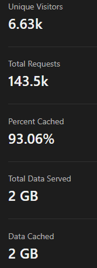

Over the last couple of days, Cloudflare [suffered a significant outage](https://blog.cloudflare.com/post-mortem-on-cloudflare-control-plane-and-analytics-outage/) across its control plane and analytics environments. First things first: **no, I'm not leaving Cloudflare over this**. I've been a Cloudflare user for a long time, since the early days. Back when 12- or 13-year-old me was tinkering with building websites, I started playing with Cloudflare's free CDN offering. Nowadays, I use a variety of their products across CDN, WAF, Access/Zero Trust, WARP, etc. For me, this outage doesn't have a major impact on my thoughts on Cloudflare, they provide me with a valuable service.

In fact, the article you're reading right now is coming to you from behind Cloudflare (likely fully cached). Cloudflare caches about 93% of my traffic (a 30-day stats report is on the left). This significantly reduces the load on my server (which is on AWS LightSail) and means I can factor in far fewer resources for my own site (I also host [websites I built](https://domkirbycreative.com) on the same server). In addition, you're hitting my website only after Cloudflare's security measures (including my custom rules) and then ModSecurity have all evaluated your request. The login to this website is behind Cloudflare Access and uses AAD SSO. This happens at the network layer before you even hit my server. They are also my authoritative DNS provider, they manage DMARC for me, and deliver DNS-based filtering at my home (in addition to SSE on my devices). You get the idea, I get immense value out of Cloudflare.

**But of course,** we're here to talk about the outage. **The reason** I continue to trust Cloudflare after this and other outages relates to **their humility**. A lot of companies who've fallen victim to incidents can take a page out of Cloudflare's book.

## But First: What Happened?

Speaking of humility... After an outage, Cloudflare releases a [pretty damn exhaustive post-mortem](https://blog.cloudflare.com/post-mortem-on-cloudflare-control-plane-and-analytics-outage/), complete with where they went wrong. In this post-mortem, they explain that a cascading series of power events causes them to lose a major component of their core infrastructure, which drives their management planes and analytics.

## Here's where the humility comes in...

Definitely read that post-mortem if you'd like. You can see that there's plenty of blame to go around, and they pass it to the right folks. It seems clear that the datacenter provider messed up in some of their own operations. **However**, they don't go hanging the entire outage on their head. Clearly, Cloudflare wasn't meeting the level of redundancy they had committed to (and thought they had). Any good post-mortem has a rundown of _what happened_ and _why_. A **great** post-mortem also spells out where mistakes were made and _how they are going to be prevented in the future_.

In my opinion, Cloudflare clearly took responsibility for where they went wrong. More importantly, they've shared what they are going to prioritize in order to prevent this problem in the future. How many infrastructure providers in your wheelhouse are that transparent about these things? Probably not many.

 

So, to sum it up. Am I disappointed about the outage? Yes. Am I going to leave Cloudflare over it? No. Is there a line where I would leave Cloudflare? Yes, but we're not there yet.
