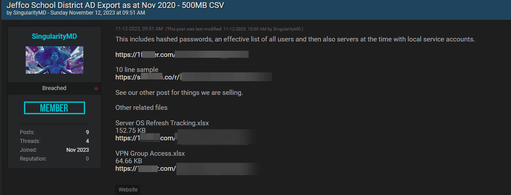
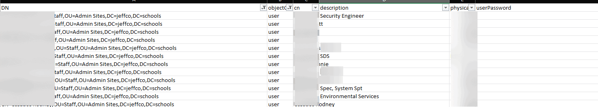
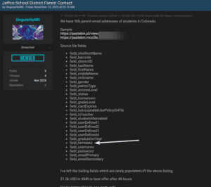

**This is an update to my story on the [Jeffco Schools incident](https://domkirby.com/blog/another-school-district-targeted/). Please refer to my "we are human" statement on that post. Defenders: We still see you, and we still empathize with what you're going through right now. This story will likely develop further, and material facts may change.**

After the latest update from Jeffco on what data they suspect was accessed, my naturally curious self did some digging. I see a lot of value in researching an incident and understanding the adversary and have done it several times. As such, I know where to look. Believe it or not, nowadays you need not venture onto the "dark web." There are 'breach forums' and data marketplaces available on the plain old internet nowadays and indexed on Google. Needless to say, it took me all of five minutes to find this data. Note: While this data wasn't hard to find, I won't be sharing it or links to it. I see not value in aiding in the spread.

\[box type="info"\]As a party to this incident, I'm simply one that got wrapped up in it and also has some knowledge. I searched for this data for research purposes and have no intent to use it further than to share more information about the incident. If I found it in five minutes, plenty of others have it too. \[/box\]

## Here's What I Found

\[caption id="attachment\_1582" align="aligncenter" width="1153"\] Data available for free on a popular breach sharing site.\[/caption\]

### Active Directory Data

\[caption id="attachment\_1583" align="aligncenter" width="732"\] This is what the data dump looks like. I've redacted to actual names, as I feel no need to contribute to the spread.\[/caption\]

On a popular data sharing and selling marketplace, the first piece of data I stumbled upon was a data dump of Active Directory from 2020 (in one big CSV). For those that don't know, [Active Directory](https://en.wikipedia.org/wiki/Active_Directory) (AD) is a Microsoft product that centralizes user identity in a Microsoft-based network. It provides the fundamental layer of user information and can be used as a source of authentication for just about anything. Being what it is, AD tends to contain a lot of user information. This dump contained the following information, and was allegedly current in 2020:

- The dump contains _user_ and _computer_ object types.
- 368,129 of the 389,031 records are **users** (typically a person but can also be a service account that allows a piece of software or hardware to interact with the environment).
- When filtered by students, 87,933 of the records are tallied. This means that 87,933 of these records exist in a "Students" Organizational Unit (think of those as a folder).
    - Of note: Many of those are 'template' accounts, used as a reference to create real student accounts.
- From this data on students, one can gather:
    - First and last name,
    - The school they were attending in 2020,
    - Their student ID number and email address.
- Parent/guardian accounts (like the ones used to login to the parent portal) are also present with password hash data. _**You should immediately change your password on Jeffco's** **systems and** **ensure that password wasn't being used elsewhere.**_ For parents/guardian accounts, Jeffco provides a tool to change your password [**here**](https://pam.jeffco.k12.co.us/).

Additionally, filtering by staff renders 17,107 of the records, most of which appear to be actual people. This shows first and last name, username, staff email address, and the site at which they work. For many, it reveals a job title or department as well. **Note:** This data also contains values related to **hashed passwords** which, given time, are crackable. **Ensure you are using unique passwords in general, but be sure to burn any password you used on Jeffco's systems.**

**Another note on passwords:** During their original response, Jeffco reset all internal (student and staff) passwords. This was 1) a really important action to take and 2) helps mitigate the risk of password hashes being out there for student and staff accounts.

### Other Bits

In that same post I pictured above, you'll see a couple of other links. This seems to be somewhat 'less impactful' data but important nonetheless:

- Documentation pertaining to various VPN groups the district uses to allow remote network access (little user data).
- Documentation that appears to list out services for operating system upgrades. The purpose of the servers are listed in some cases, and points of contact for ensuring a smooth upgrade as well. This data in particular seems rather old (pre-2020).

### Second Data Dump

\[caption id="attachment\_1585" align="aligncenter" width="300"\] The post from SingularityMD selling student/parent information (click the image for full-size).\[/caption\]

Further digging revealed another post, and this one is more "premium" according to the threat actors. They are looking to sell (or have sold) this data for around $1,500 (in cryptocurrency). Many times (as in this case), threat actors will provide a sample to prove that the goods are real. In this case, it provided 24 lines. Here's the pertinent information:

- A "Site ID" which I would assume is a school locator.
- Student first, middle, and last name.
- Student grade (most in the sample are PK)
- **Student date of birth**
- An email field, seemingly containing parent contact email addresses.

There are other fields there, but that's what I wanted to call out. _The name and date of birth combo is particularly concerning_. SingularityMD claims there are 90,000 or so records in this dump. I would be inclined to believe them because they've provided a sample. As for where this data came from, the CSV describes users as being "Patrons." My guess would be that this is the Folett Desity (library) data that SingularityMD referenced.

## So What Now?

That's a tough question. I'm not in a position of authority to declare a breach. But, if I was, I would be pulling that word out at this stage. As for this information, let's dive through what parents or guardians should consider. To sum it up, here's what we know we can get about students (the key pieces):

- First and last name,
- Student ID number,
- Date of birth,
- Which school they are tied to (at least as of 2020).

And here's what we know for parents/guardians:

- First and last name,
- Username,
- Contact email,
- Hashed passwords.

### Steps you should take to protect yourself (and your kids)

- Change your Jeffco password, and make sure you aren't using that anywhere else (and change it). I **strongly** recommend using a [password manager](https://domkirby.com/blog/i-moved-to-1password/) to help you manage unique passwords for all of your logins.
- If you haven't already, lock your kids' credit reports and enroll them in credit monitoring.
- Have a discussion with your kids about internet safety, and rehash the basics. A **great** resource for this is [**commonsense.org**](https://www.commonsense.org/).
- Be extra vigilant: Leaked email addresses are being sold, and the buyer will want ROI. You need to be on the lookout for phishing messages and other scam messages. Be mindful, they will likely know names of your children, they can up the fear factor here.

The elephant in the room, in my mind, is the list of kids and what school they attend. Our minds can go to a dark place knowing that's out there. A stranger danger conversation wouldn't hurt, **but...** The buyer of this data will likely be either another data broker, or some miscellaneous threat actor in another country looking to leverage the contact info for scams. We can't predict who will have access to this information, so take whatever steps you feel are important to you as a parent/guardian.

## In Conclusion

This stuff is scary. Data breaches suck, they suck worse when our kids are in the middle of it. Take a breath and think through what steps you want to take to protect your kids and yourself. These datasets cover a chunk of what data SingularityMD claims to have taken, but there may be more to come.

Take action, use resources like [Common Sense](https://commonsense.org) and [general cyber advice from CISA](https://www.cisa.gov/news-events/news/4-things-you-can-do-keep-yourself-cyber-safe).

## Why does this data differ from Jeffco's statement?

I still support the humans working through this incident, see my original post where I spell out what they go through in an incident. You'll notice that what I share here differs from what the district has made statements about. **Here's why:** Investigations are complicated, and investigators are going to limit what the victim can say about them and when they can say it. Just because I found this information publicly and shared it before the district doesn't mean there is some "cover up." It means that they are still piecing huge amounts of information together to give you a clear picture.

I'm not giving you a clear picture here; I'm telling you what I found. I feel like it's important that I tell you this now, so you can take action. Sharing this information will not hurt an investigation, this information is public on the regular internet. However, as one of the victims of this incident, Jeffco will be limited in when/how they can share this information. The people working this incident truly care about you and your family's information and safety. They are working hard to mitigate the threat, and I'm confident that they will share additional information when and how they can. **I urge you to continue to have compassion and empathy as they work through these difficult times.**
