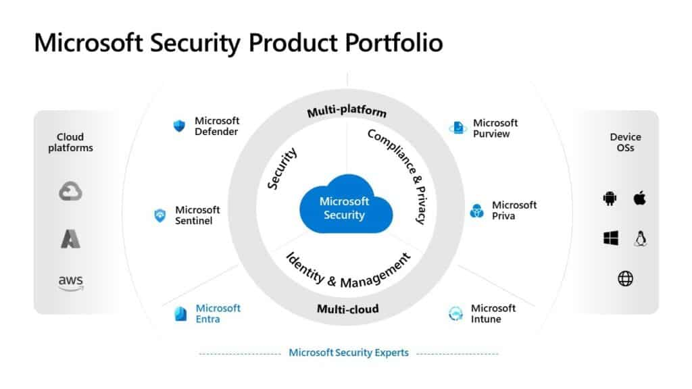
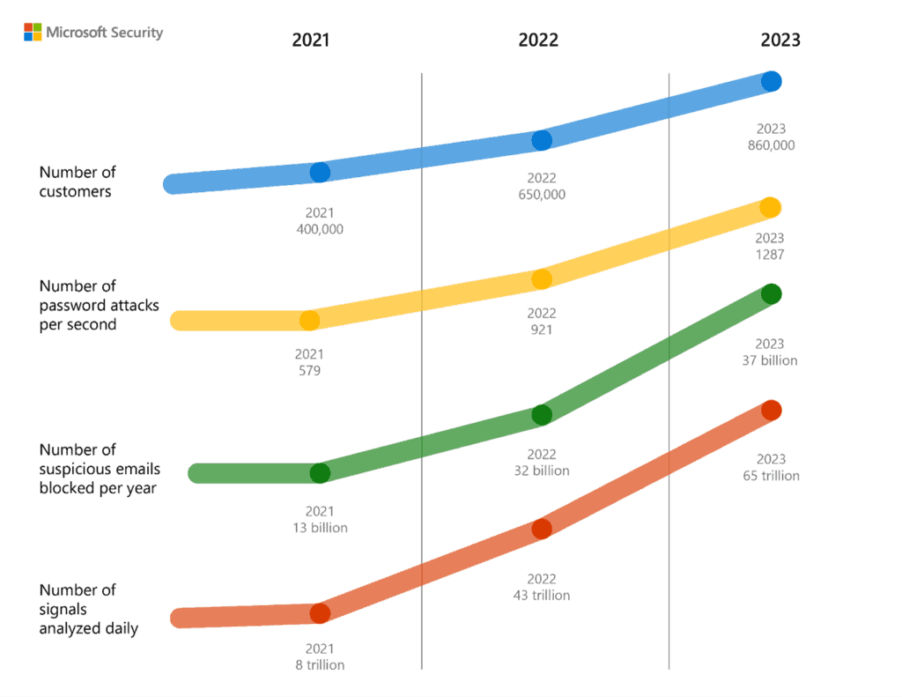
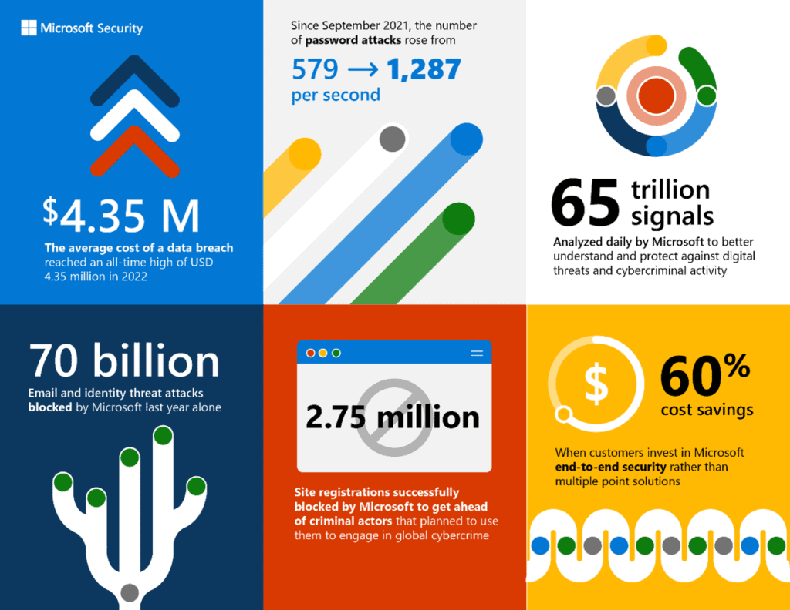

In late January, Microsoft [shared](https://domk.pro/oWqyfp) that their Microsoft Security has grown to over **$20 Billion** (USD) in revenue per year. That's a massive milestone and puts them far ahead of much of the cybersecurity product market. Even cooler for a nerd like me, they put out some important data. Around that same time, I shared a Defender success story on LinkedIn, and it blew up.

<iframe title="Embedded post" src="https://www.linkedin.com/embed/feed/update/urn:li:share:7027506393825910784" width="504" height="473" frameborder="0" allowfullscreen="allowfullscreen"></iframe>

With the recent huge news from Microsoft, combined with the popularity of that post, I figured it's worth it to take a bit of a dive into the world of Microsoft Security.

## The Microsoft Security Lineup

There was a time when most of us (myself included) certainly wouldn't consider Microsoft a security company. However, the explosion of Microsoft Security products in capabilities simply cannot be ignored. They've built a **behemoth** with incredibly high-end capability. Before we talk numbers, let's check out Microsoft's security product lineup.

\[caption id="attachment\_1369" align="aligncenter" width="1024"\] Credit: Microsoft\[/caption\]

Microsoft has done a ton of growth in their product space. Despite a lot of difficulty choosing names (if you're a product manager reading this, please cut it out), they've finally built a portfolio that is understandable and covers a wide range of needs. Broadly, they've categorized these as **Security, Identity & Management, and Compliance & Privacy**. As you can see in the graphic, they deliver security solutions across all three clouds - yes, even their hyperscale competitors - and every relevant device operating system (Windows, macOS, iOS, iPadOS, Linux, Android, and on the Web). Let's break down some of these product lines.

_Note: You wouldn't read the whole thing if I covered all the products. For the most part, I'll be covering just SMB relevant products._

\[box type="info"\] There is no such thing as 100% security, and it's everyone's responsibility to pick the best operational match for their security stack. I'm not endorsing any product, just sharing what they are and what I _personally_ like about them. \[/box\]

**Want to skip the product writeup and go to the analysis? Click [here](#tldr).**

### Microsoft Defender

Defender is the flagship security line of the bunch, and covers the primary protective layer that can be applied. Here are the key Defender products to pay attention to:

- Defender for Microsoft 365 (Plan 1 included in Business Premium)
    - Protection across the Microsoft 365 space including Exchange, OneDrive, SharePoint, Teams, and Power Platform. It provides key services like Safe Links, Safe Attachments, and Anti-Phishing, and it does a damn good job at all three (Safe Links was one of the protective layers I mentioned in the LinkedIn post).
    - **Safe Links** scans links when they come in, and rewrites them so they can be blocked should the link later become malicious.
    - **Safe Attachments** sandboxes attachments that hit a certain clipping level, and analyzes their behavior before delivering them to the mailbox.
    - **Anti-Phishing** hunts for common phishing tactics and, more importantly, provides warnings or takes action against impersonation attacks and the like
    - **Plan 2:** If you upgrade Defender for Microsoft 365 to Plan 2, you add on better incident investigations, phishing simulations, and more
- Defender for Business (Included in Business Premium)
    - Defender for Business is the "trimmed-down SMB" version of Defender for Endpoint. It's an immensely powerful EDR platform coupled with built in vulnerability management and incident remediation.
- Defender for Cloud Apps
    - I love DfCA. It costs a little to add it (unless you have E5) but it is an insanely powerful tool. DfCA extends much of the protection of Defender for M365 into a myriad of other cloud applications. Need to limit what someone can do in Salesforce (like prevent file downloads)? DfCA can do it! Need to make sure nothing malicious is in the Dropbox for Business account? DfCA can do it. You get the point, there's a reason it sells well.
- Defender for Cloud
    - Have workloads in Azure? Defender for Cloud will protect your workloads at the OS layer on servers **and** the subscription layer for the subscription itself **and** PaaS workloads like Azure SQL. Have workloads on AWS? It'll do all that there too! Have workloads in Azure, AWS, and GCP? Protect them all from a single pane of glass. Seriously, even for SMB, Defender for Cloud is a no-brainer addition to your cloud environments.
- Defender for Endpoint (Enterprise)
    - Defender for Endpoint is the full-blown Microsoft EDR product. It has everything in Defender for Business and then some, all on steroids. Centralized incident command, deep threat analytics across your fleet of workstation and mobile devices, SIEM integrations, the list goes on.

I'm really just scratching the surface here, but trying to illustrate that Microsoft has really sprawled out their security product reach to cover a number of platforms. Another worthy note is **integration**. Defender for Office and Defender for Business (both in Business Premium) can stack together for combined incident command. If a payload slips past Safe Attachments and is caught by Defender for Business, DfB and DfM will talk to each other and proactively take remediation steps like figuring out who else received the same file and getting rid of it.

These products also include the features you'd expect like quarantine policies, reporting, ability to integrate a SOC vendor, endpoint isolation, etc.

### Microsoft Sentinel

Sentinel is Microsoft's cloud native SIEM product powered by Azure, and connectable to a ton of data sources including Microsoft's own intelligence (more on that later). In terms of SIEM products, it's probably one of the most powerful out there, but my exposure is quite limited. In my opinion, you shouldn't just implement a SIEM if you don't have the talent (like analysts) to operate it. In the SMB, I'd opt for a SOC as a Service vendor like [Pillr](https://domk.pro/InPBdC).

### Microsoft Entra

Okay, this is one of those naming struggles I was talking about, though I do see the purpose of the naming. The flagship product of Entra is one we all know well: **Azure Active Directory**. AAD's been around awhile, so I won't bore you with all the details. However, there are some other exciting products in the Entra lineup:

- **Entra Permissions Management** _Per Microsoft: Discover, remediate, and monitor permission risks across your multicloud infrastructure with a cloud infrastructure entitlement management (CIEM) solution._
    - Essentially, Entra PM lets you review, monitor, manage, trim down, assign, unassign, and all the other verbs you can think of for permissions across a variety of cloud services and applications. Learn more about it [here](https://domk.pro/momuGV).
- **Entra Verified ID** Verified ID is built on an emerging concept of "verifiable credentials" and brings decentralized identity capabilities into the enterprise, include CIAM (Customer IAM). [More about Entra Verified ID](https://domk.pro/GujQ17).
- **Entra Workload Identities** Okay, I really like this one. This product manages identities issued out to applications, device, and other non-humany things. It looks for signs of compromise, helps you trim permissions, and more. [More](https://www.microsoft.com/en-us/security/business/identity-access/microsoft-entra-workload-identities).
- **Entra Identity Governance** (in preview) This one is just plain sexy, and will aid greatly in your cybersecurity _and_ compliance initiatives. Identity Governance can run your entire identity lifecycle management process for internal users and business guests alike. I'm really excited to watch this one come to fruition.

_To sum it up,_ Entra is all about managing the points of _entry_ into your environment (see what they did there).

### Microsoft Intune

Intune needs no introduction. In 2023 (in my opinion), there simply isn't a better device management platform in existence, with one exception... To this day, I love [Addigy](https://domk.pro/8CRO6j) for Macs. That said, they integrate tightly with Intune for one of the most key capabilities: With Intune, you can manage access based on device inventory and **device health**, making it harder for bad guys to get in on a stranger device.

### Microsoft Purview

Queue another naming complaint. A lot of things have made it under the Purview brand, including tools you probably use. Purview is all about understanding the happenings in your environment, and enforcing security and compliance rules **on your data**. Purview has a long line of products, but the ones likely most relevant to you are:

- Purview Information Protection - formerly MIP then formerly AIP. Dynamic labeling policies for classification and control of sensitive data.
- Compliance Manager (enterprisey licensing warning here) - Formerly Microsoft Compliance Manager, apply compliance policies across your workloads - mixed with a light compliance management product that works outside of just Microsoft
- Data Loss Prevention - policy based action on data trying to go where it shouldn't
- eDiscovery - Discover and manage your data in-place with end-to-end workflows for internal or legal investigations

There's a ton of other products too like data cataloging, data mapping, insider risk management, communication compliance, and [more](https://domk.pro/9cvrSZ).

### Microsoft Priva

[Priva](https://domk.pro/NSGlhu) is Microsoft's privacy risk management platform. Admittedly, I know the least about this one and I haven't really dove into it. it flaunts some pretty powerful capability such as insights into how much PII you're storing, the capability to stop the movement of PII, and more. I see this being a valuable product as privacy laws come even more so into play.

## That's a lot of products but, how did it get to $20B in Revenue

Ah, now to the fun part of the article! Now obviously, I'm speculating a bit here, but here's my take.

### Product Diversity

I went over all those product lines for a couple of reasons. One, I wanted to cover you in case you weren't aware of the Microsoft Security lineup. But second, I wanted to show you how broad it stretches. Microsoft has products for identity, devices, cloud workloads, cloud services, compliance management and even compliance with privacy regulation. Better yet, **they all talk to each other** and can work together. The broad coverage creates a natural sprawl, especially in enterprise.

### Efficacy

Nowadays, the top 5 or so security products are nearly indistinguishable from a technical perspective (especially on the endpoint). Detection rates are often head-to-head. In all the Defender products I've used, I've seen very little issue with the efficacy of the product. That is to say, all of the products I've tried do a damn good job defensively **and** right of the boom. The incident investigation capabilities in Defender for Business are top-notch and getting better too!

### Data

These products are so powerful due to the sheer amount of data Microsoft feeds into them. Remember what else Microsoft makes? Oh yeah, WINDOWS. They get security intelligence from nearly every single Windows device, as well as every logon to an Azure AD identity, Microsoft Account, etc. Their extensive Azure network also feeds threat intelligence to one of several Global Security Operations Centers who all work to defend the network and feed data into the Microsoft Security Graph. In fact, Microsoft touts processing over **65 trillion** security signals per day. This chart does a fantastic job summing up the sheer amount of data and activity we're talking about:

\[caption id="attachment\_1372" align="aligncenter" width="1024"\] Credit: Microsoft\[/caption\]

I mean, imagine the amount of conclusions that can be drawn from 37 billion suspicious emails in a year, 1287 passwords attacks **per second**, and activity across 860,000 customers. I'd wager they process more cyber intelligence than some industrialized intelligence agencies.

### Involvement

In addition to data, insights, and stellar products, Microsoft also has their own Digital Crimes Unit. They work with national and international law enforcement (and probably some other agencies that don't get public mention) to take down criminals. The [2022 Microsoft Digital Defense report](https://domk.pro/3C0iPb) indicates they took down 531,000 unique phishing URLs and 5,400 phish kits, killed over 1,400 malicious email accounts, and blocked registration of 2.75 million malicious site registrations.

This involvement speaks volumes in the larger community, and they stretch far beyond just slinging products around.

### Value

There's just no denying that there is a lot of value in centralizing your stack. Not only from a cost savings perspective, but from the viewpoint of "all of these products talk to each other." Suddenly something that happens on your endpoint causes action on email. Something that happens in Salesforce triggers an actionable compliance alert that can even temporarily interject by locking a user out, you get the point.

\[caption id="attachment\_1374" align="aligncenter" width="1024"\] Credit: Microsoft\[/caption\]

 

## What about the channel?

One of my favorite things going on over at Redmond lately, is their open ears. Like never before, they're listening to SMB needs through the lens of the channel (at least from a product perspective, I don't write about MCPP or NCE 😐). With that in mind, what I can say is multi-tenant management and other game changing features are coming in **very hot** in the form of Lighthouse. You'll just have to wait and see.

## To sum it up...

I'm not at all surprised that Microsoft Security has hit the $20B ARR mark, it just makes sense. Between the cohesive products, constant innovation, massive intelligency capability, and perhaps (finally, maybe) a good product brand story, I'd expect Microsoft's security growth to continue in all sectors.
