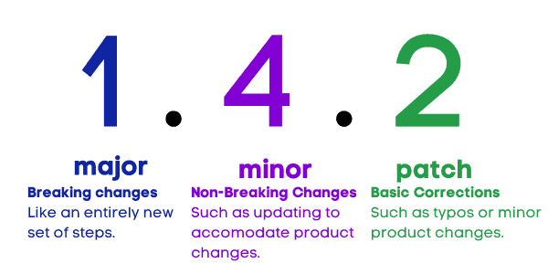

One of the only constants in technology is _change_. Technology advances, we implement new stuff. Or, some sort of upgrade or new version changes the way we do things. At the same time, successful technology and cybersecurity management is hinged on effective documentation, policy, and procedure **(governance)**. The intersection of these two challenges can easily be the death of your defensibility approach. I covered this in a recent policy course I taught, but though this topic would be relevant for everyone, let's dig in.

## The Role of Documentation in Governance

Generally speaking, governance **is** documentation. We use documentation to understand how our systems are configured, the different ways we operate/maintain them, and set expectations for our users. Having solid sets of documentation that includes policies, procedures, and configuration documentation is essential to defensibility and manageability. When we have robust policies that we enforce, procedures that we follow, and a well-documented system state, it becomes _possible_ to document our work in a defensible manner.

## Documenting Our Work

Once we have defensible procedures, we need to be able to show that we're following them as written. Having a well written procedure simplifies this process, because our ticket note(s) can notate what procedure(s) we follow to narrate how we completed a task. It is equally important that our automation documents itself too. This is why it's valuable for tools like [Rewst](https://www.pax8.com/en-us/vendors/rewst/) to have PSA integrations that can open a ticket with notes or time. Long story short, we should be documenting _what_ we did and _how_ we did it. The _how_ can be simplified by citing the procedure used.

## Where Version Control Matters

A key tenet of governance is the ability to demonstrate ongoing management and, more importantly, **improvement** of your cybersecurity program. As such, we need to maintain a _history_ of our processes and procedures. Additionally, specifying a version number of a policy or procedure will allow us to document it in our notes. For example, documenting that we followed version _2.1.0_ of the _user addition_ procedure allows us to quickly go back and review that version so that we understand how a user was added. It also allows the same in the event that there is a discovery or forensic investigation.

## Easy Versioning: Semantic

My favorite versioning method for this type of documentation is the _semantic_ numbering system. Semantic versioning is meant for software wherein you have the **major release** of the software, followed by the **minor release** (such as a feature update), followed by the **patch** (such as a security update of bugfix). We can apply the same principal to our policies and procedures:

- **Major release:** A new document or significant revision that breaks or significantly changes a process or policy.
- **Minor release:** In processes, these should be used to account for things like changes in the software that materially change the steps of the process, but don't necessarily "overhaul it." For policies, this should reflect "housekeeping" updates such as changing a definition or perhaps adding a data classification.
- **Patch:** Your "patches" are just that, correcting issues. Perhaps there was a typo in a published policy, or the steps in the procedure were not clear.

Semantic is nice because it avoids us having version 157 of our policy due to a bunch of minor updates.

### Use What You Got

While I really like the semantic numbering system, it's certainly not essential. If you're using a documentation tool, GRC tool, or other content management tool with its own versioning, use what you got! The most important parts of versioning are:

- Distinction between versions including the "latest"/live version
- The ability to go back to old versions and identify the change
- The ability to _reference_ your versions when documenting work

 

How do you version your documents?
