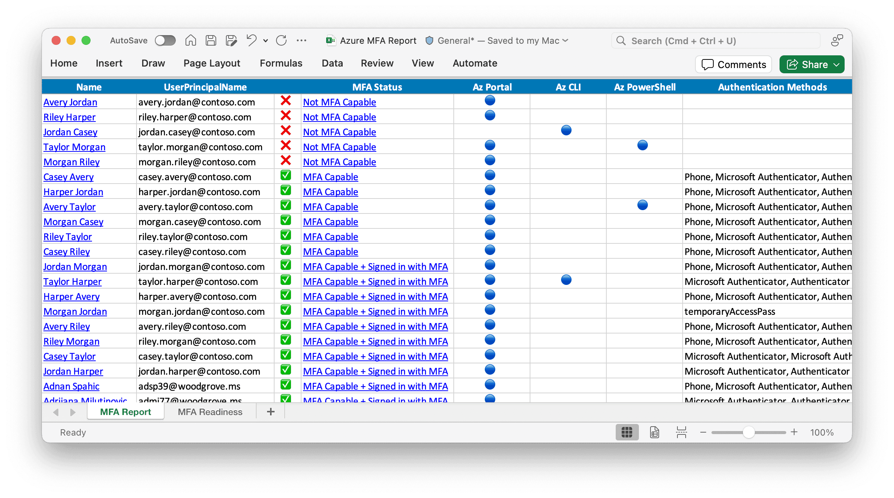

We're a little over a month out from Microsoft's upcoming MFA mandate. On October 5th, 2024, the Entra Admin Center, Intune Admin Center, and Azure portal will **finally** mandate multifactor authentication. This means that, regardless of your tenant settings, you will be **required** to complete MFA in order to access these portals. This protection will also extend into anything accessed through these portals, such as AVD management or Windows 365 management. Read Microsoft's update [here](https://techcommunity.microsoft.com/t5/microsoft-entra-blog/mfa-enforcement-for-microsoft-entra-admin-center-sign-in-coming/ba-p/4230849?utm_source=substack&utm_medium=email).

We are well beyond the days of MFA being a "security enhancement." It's now [compulsory](https://domkirby.com/blog/mfa-is-a-compulsory-item/) in any recognized framework. As such, I hope this doesn't come to you as a surprise and you're ready for it. Nonetheless, it's a good idea to double check your configurations and be sure you're ready.

## Audit & Fix: Ensure MFA is In Place

First and foremost, audit the tenants under your management! Now is the time to see if you have an old admin account, or perhaps a [break glass account](https://domk.pro/tminus-bga-best-practices), without MFA enabled. This is a dangerous, but not uncommon mistake we tend to make when setting these things up.

Conveniently, Microsoft provides a nifty PowerShell tool called "MSIdentityTools." You can use the [Export-MsIdAzureMfaReport](https://azuread.github.io/MSIdentityTools/commands/Export-MsIdAzureMfaReport/) tool to get a convenient report of your users and which ones are not properly setup for MFA.

\[caption id="attachment\_1790" align="aligncenter" width="2390"\] Image Credit: Microsoft\[/caption\]

## Audit & Fix: Conditional Access

In the same vein of break glass accounts, we tend to exclude those accounts from our conditional access policies. Microsoft strongly recommends [using Conditional Access over user-based MFA](https://learn.microsoft.com/en-us/entra/identity/monitoring-health/recommendation-turn-off-per-user-mfa) and will be migrating all Entra Premium tenants away from user-based MFA in the near future. You should get ahead of this now for your break-glass accounts to maintain control of htese changes.

**Recommendation:**

- Continue to exclude your break-glass accounts from your "regular" MFA policies
- Configure a **[Conditional Access Authentication Strength](https://learn.microsoft.com/en-us/entra/identity/authentication/concept-authentication-strengths)** specifically for break-glass accounts (I prefer using hardware FIDO keys and having no less than two of them stored in trusted/separate locations).
- Create a Conditional Access Policy to require your new authentication strength for your break-glass users.

## External Identity Provider or MFA

If you're using a third-party MFA solution, such as Duo, ensure you are using the **external authentication methods** preview. The legacy Conditional Access "custom control"will not satisfy this new MFA requirement. As such, users using this method will be prompted to setup Microsoft MFA if you do not get ahead of this.

If you're using a third-party identity provider such as Duo SSO, ADFS, Okta, etc., you need to ensure that your IdP is passing back an **MFA** claim. Most mature solutions already do this, but it's best to reference their documentation to ensure you have things setup properly.

## Conclusion

It's worth noting that if, for some gross reason, you cannot meet this MFA requirement by October 15, you can apply for an extension [here](https://aka.ms/managemfaforazure). But seriously, just get it done!

This step is **long overdue** and I'm excited to see it finally coming to fruition.

I'm looking forward to this requirement expanding over the next few years, and I hope that we someday have **100% strong authentication** numbers in Entra!
