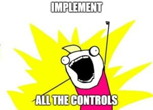

A lot of us, me included, have spelled out some "doom and gloom" about AI and its impact on cybersecurity. Truth is, there's a lot to worry about, _especially_ for the SMB sector. Data governance is non-existent, and most of these customers _don't even know_ what sort of data they have. We have a lot of work to do. **But** I also think there are some positives - I'd like to shine that light here!

## Recap: AI is Cool... and Scary

I asked Copilot to tell me about the risk of implementing Copilot. Here's how it summed it up:

> _In summary, responsible AI adoption necessitates a holistic approach. Organizations must define clear policies, maintain an inventory of AI assets, and implement controls. By doing so, they can harness AI’s potential while mitigating risks. Remember, there’s no one-size-fits-all solution—each organization must tailor its approach to navigate the AI landscape responsibly._
> 
> \-AI Generated (Microsoft Copilot)

I think it missed the mark a bit, because I asked it specifically about data governance. But let's give it credit for saying "implement controls."

### What Controls?

Well. I would be remiss if I didn't take the opportunity to say _all the controls_. But many of our customers are in a hurry to implement AI, so here's where I'd start:

- All of CIS IG1, foundational stuff
- Safeguards from CIS
    - Control 3 (data)
    - Control 5 (account management)
    - Control 6 (access control)
    - Control 8 (audit)

At Pax8, we're getting ready to release a more prescriptive set of safeguards, so be on the lookout for that. But, in a nutshell: **you need to understand what data you have, where it lives, how it moves, who has access to it, and manage all of that**. Remember, Copilot will put _everything_ a user has access to at their fingertips, one properly written prompt away. There is a real risk of users stumbling on something they didn't know they could but shouldn't be able to!

## Enough Doom and Gloom: What's the good news??

Okay, I promised to be positive here. We have our fair share of challenges, but there is good news! **I actually think the Copilot and, to some extent, other AI offers are driving SMB cybersecurity in a positive direction.** Here's the data, and by data, I mean my scientific calculation on my gut feelings:

- Since the release of Copilot, I have had more data governance conversations for SMB clients than in my entire career,
- MSPs that I talk to are seeking out structured, efficacious, efficient, scalable ways to drive data assessment products and services into their SMB clients, **and**
- Those same MSPs are looking at long term resiliency for their customer data governance programs.
- And finally, **vendors** are rapidly pivoting their roadmaps to be able to support these motions - I've had some of the most inspiring vendor meetings I've had in a long time in the last 4 or so weeks.

Does this represent the status-quo at large? Absolutely not. Plenty of customers/MSPs will just "gimme" this solution and accept all the risk. But forward-thinking customers and MSPs are thinking about these data conversations and leveraging the AI opportunity to drive more mature cyber programs into the SMB.

I don't know what 'critical mass' is for turning the scales, but I do know we aren't there. I also don't think the Copilot/AI conversation will get us there. **But** I do think that Copilot is driving positive conversations, and that is a welcome change.

If you're charged with AI strategy at your MSP, **please** look at sustainable and secure adoption pathways. We cannot just let Copilot loose (even per Microsoft), we need to implement basic security and data governance controls to prevent headline-worthy blunders!
