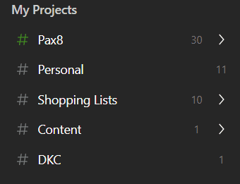
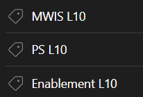
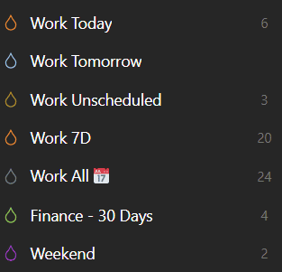
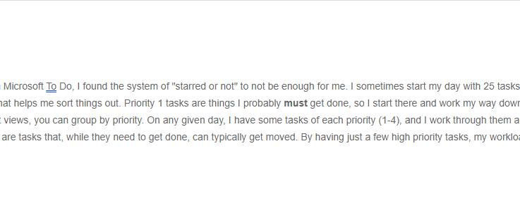
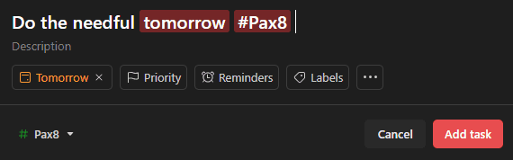

If you know me, you know I've been a longtime proponent of [**Microsoft To Do**](https://www.youtube.com/watch?v=ee3G68lnDQ0) and its vast integrations across the Microsoft ecosystem. To this day, Microsoft To Do is one of my favorite task management applications. However, as the number of inputs in my life (personal and professional has grown), I've started to notice a need for a "more complicated" method of sorting out everything coming into my world (and leaving my desk). To that end, I realized I was starting to naturally part ways with the way To Do looks to manage tasks. I tried building more lists, but that become a challenge. A couple of other things I tried (like hash tagging) simply didn't work for me. I also felt too much friction when entering and sorting my tasks

Alas, the time had come to try something new and different. Something that is still **simple to use** but also _complicated enough_ to help me sort things. I needed something as close to frictionless as I could possibly get. It didn't take me long after starting my search to find an answer that admittedly surprised me: [Todoist](https://todoist.com/). There are some key points in Todoist that drew me to it, and I've been on it for one full work week at this point, so it felt like a good time to dive into it a bit more.

## Organization

One of the first things about Todoist I noticed and liked almost immediately was its organization system. Todoist has a couple of different ways of organizing tasks: **Projects (with Sections) and Labels**. Organizing things into "Projects" let's me put them in different parts of my life, and different sub-parts of those. This was the first thing I latched on to, and quickly found myself with a convoluted structure of projects that I pretty quickly worked down to what you see in the screenshot. I saw some videos where people are strict advocates of 3 or so projects, and some that have way too many. I tried to think of projects as different inputs or areas of my life where I have tasks, and labels offer a different level of specificity where needed.

### Projects

- **Pax8:** Self-explanatory. Pax8, and some subprojects under it such as #People contain all the tasks I need to do for work. Notably, the parent child relationship of projects helps when making filters (more on that later).
- **Personal:** These are all of the "not work" tasks. I didn't see a need to do subprojects here, but it does have some sections under the Personal project (House, Kids, Finances, etc.).
- **Shopping Lists:** Okay I might cheat the task karma just a bit here. But the Shopping Lists Project has subprojects for actual stores I shop at. When I'm at that store, I just pull up that subproject and I have my list handy (meaning I just add items to it whenever I think about it or notice my kids drank my last San Pelligrino).
- **Content:** This is where I put tasks for writing content. As I type this, I'm knocking out a task I had to write this post 😊.
- **DKC:** Has tasks for things I need to do related to DKC. For example, I'm a bit behind on some reconciliation so there's a task in there for that.

### Labels

Labels are essentially tags (in fact, I think they should be called tags). They can be added to a task irrespective of which project that task lives under. I try to use these for things that need a certain amount of specificity beyond the project/section. For example, I may have something in the "People" project under Pax8 because that's the area it supports. However, if that task came out of my weekly Leadership Level 10, I need to mark it as such with a label so that I know to update the Level 10 next time around. _Fun fact, I'm regularly in four "Level 10" meetings, but at least not all of them are weekly._

### Filters

Filters are where the rubber **really** meets the road in Todoist. With a system of projects and labels, it may seem like a real chore to keep track of everything. Filters fix that problem super elegantly. A filter is basically a "view" you can make based on any number of elements, and it uses a cool text-based syntax to accomplish that. The graphic shows the core filters I use (the ones that are favorited). Let's break the down:

- **Work Today:** This is where I start my day. Everything I said I was going to get done that day shows up in this view (or anything that is overdue). I accomplish this with the text query "(today | overdue) & ##Pax8" which translates to "thinks due today or overdue in any project under Pax8." Cool syntax, right??
- **Work Tomorrow:** I poke this typically towards the end of the day to see what I've got going on tomorrow. I'm one that likes to know, so even just glancing at the number is helpful (I'm writing this on a Friday, so the number is presently zero). I also glance at this if I think I need to reschedule a today task to tomorrow, it helps me prevent overload.
- **Work Unscheduled:** When I add a task (more on that later), I often don't specify a due date right away unless it is of high importance. As such, I need to keep tabs on unscheduled tasks.
- **Work 7D:** Work tasks for the whole week, in a board view (another thing I like). This just helps me glance ahead at that week and see if I need to rebalance anything.
- **Work All:** This view is particularly cool. It is a calendar view, so I see all my tasks laid out on a calendar with a neat column for unscheduled tasks. I can drag and drop tasks on a day to "dispatch" them to myself. I can also use this view to move tasks around days to help me rebalance them.
- **Finance - 30 Days:** A 30-day calendar of my finance tasks. Almost all of my finance tasks are recurring tasks that remind me to pay the bills.
- **Weekend:** Personal tasks that I've labeled with "Weekend" and are things I (might) get done on a Saturday or Sunday.

The "Work Today" view is a powerful view in my opinion. It separates from the default "Today" view (which is all tasks due today) and only shows me my work tasks. Super handy for when I'm zeroed in on getting things done at work. You could replicate this as well and have a "personal today" view if you wanted, but I just go to the default today view if I need to knock "not work" things out. If there's a key takeaway on the separation between Microsoft To Do and Todoist, it's this concept of projects, labels, and filters. It allows you to have a lot of customization around **how** you look at what you need to do.

## Prioritization

If everything is important, nothing is important. In Microsoft To Do, I found the system of "starred or not" to not be enough for me. I sometimes start my day with 25 tasks (due to me not so elegantly setting due dates). Todoist has 4 priorities, and that helps me sort things out. Priority 1 tasks are things I probably **must** get done, so I start there and work my way down (unless a task is time bound, such as a meeting follow-up). Within the different views, you can group by priority. On any given day, I have some tasks of each priority (1-4), and I work through them accordingly. At the bottom of the list, the Priority 4 tasks, I can relax a little. These are tasks that, while they need to get done, can typically get moved. By having just a few high priority tasks, my workload feels more flexible and manageable.

## Ease of Input

If a system is hard to use, I won't use it. It's just how I am, and it's likely how you are too. Because we are humans. One struggle I had with To Do is that, while it is certainly easy to use, I didn't find it easy enough. On my mobile device (Pixel for those keeping tabs), I have a widget on my home screen. Tapping it immediately brings up a task entry window. Once I enter the task, Todoist disappears. Even better, I have an add task button in the quick options you get when I drag down from the top of my screen. If I'm reading an email or article on Outlook mobile that yields a task, I can just drag down, tap add task, type in the task, and be back to the email or article.

The desktop client also has a nifty feature wherein hotkeys work whether or not the app is in focus. On my Windows machine, I can just hit _CTRL + Space Bar_ and a task entry window pops up. I jot down the task, hit enter, and I'm right back where I was. **So. Damn. Easy.** This will drop the task into the "Inbox" to be sorted later, unless I take advantage of language processing. Side note: On mobile, dictation helps a lot as well.

_Editorial note: In that gif, I paused for a moment before hitting enter so you could actually see what was happening. There is zero delay if I type and quickly hit enter_.

### Language Processing

Even better, Todoist has some language processing built in. This means that I can use my hotkey and type something like "Do the needful tomorrow #Pax8" and I will get a task called "Do the needful" due tomorrow in the project Pax8:

It also has smart processing so if I say "every Thursday" I will get a task due every Thursday. Next Thursday yields next Thursday, etc.

## Tying it Together

All things tolled, I'm going to keep working Todoist into my habits and see if it sticks, but I'm confident it will. However, I don't think this system would work if I didn't have certain habits. Most notably, I have some time blocked every week to sort through everything (Inbox, Calendar, Todoist, etc.) to make sure I have time to sort things appropriately. I usually try to make sure all of my "Inbox" tasks are sorted daily, but if I miss a day the blocked time weekly gives me time to make sure it gets done. I have a weekly recurring task called "End of Week" that guides me through this.

Some other key notes include:

- Using the tool! I don't want to remember what I need to do; I want to get it into the tool. That's where the quick input helps. If we're having a hallway conversation and you ask me for something, you'll see me pull out the phone and add the task.
- Syncing things up. Obviously, my Level 10s aren't in Todoist. I have recurring tasks on the morning of my Level 10s to sync completed Level 10 tasks into the appropriate tool. It's an extra step, but for me it works.
- Don't "over sort." At first, I made projects for every conceivable thing. This is the **wrong** approach, at least for me. My Projects represent the key things I work on, at a very high level. The tasks themselves and a selection of sections and labels break it down further.

## In Conclusion

To wrap it up. I've been a long time user of Microsoft To Do, but I think Todoist has stolen my task management heart. I'll be sure to let you know if that changes. I don't think I outgrew To Do, I think that would be a silly statement. I think my brain doesn't work at the scale I need it to with the way To Do functions is all.

**PS:** You may have noticed a popular note taking app logo in this post's image. More to come on that. 😉
