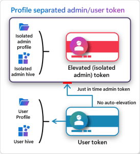

In another cool Ignite share, Microsoft announced [Administrator protection on Windows 11](https://techcommunity.microsoft.com/blog/windows-itpro-blog/administrator-protection-on-windows-11/4303482). This feature aims to protect users from malicious code or intent by creating "just in time" administrator privileges for local admins. This is an awesome, and overdue feature, that seems akin to "sudo" in Linux.

## Protecting Admins from Themselves

Local Admin is a dangerous power to have. If we're operating on our PCs as an administrator, we're leaving a **massive** threat vector open. I don't care which fancy EDR or "zero trust" product you're running. If you have local admin, we can find a way to execute our payload. Why? Because we're an admin. We have the ability to kill processes and change settings!

Administrator protection aims to solve this problem by providing admin rights only when needed. In this _just-in-time elevation_ model, the user stays de-privileged and received just-in-time elevation rights for the duration of an administrative operation (like installing software or changing the time). Once that operation completes, the admin token is discarded and a new token is created (after authentication) when a new admin task is started.

## Key Architectural Concepts

At its core, this feature will deliver three key items:

- Just-in-time elevation (covered above)
- Profile separation: Administrator protection will leverage hidden, system-generated, profile-separated windows account to create administrative tokens that are fully isolated. This makes the elevation a security boundary as the "regular" events happening on the machine are not running in an administrative context.
- Interactive elevation: With Administrator protection, users will need to _interactively_ authorize every administrative action on their PC. Furthermore, they need to authorize this with their Windows Hello credential. This is where I compare it to "sudo." The user must complete authentication before they have superpowers, and they only have superpowers for that one task.

The [announcement article](https://techcommunity.microsoft.com/blog/windows-itpro-blog/administrator-protection-on-windows-11/4303482) covers the ways we'll be able to enable/enforce administrator protection. This is a particularly exciting feature to me because it enables us to find a middle-ground for users that have local admin rights. More pertinently, it's a powerful boundary for home users who are _almost always_ local administrators on their machines.

**All of that said**, I still don't think your corporate users should be local admins 😊.
