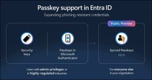

At Ignite, Microsoft announced that [Synced Passkeys](https://learn.microsoft.com/en-us/entra/identity/authentication/how-to-authentication-synced-passkeys) would become available in Entra. My initial reaction to this was that it was a _terrible_ idea. However, I've had some time to think about it, get out of my nerd brain and into my security practitioner brain. Long story short, I've had a change of heart, let's dive in. I also caught [_this episode_](https://domk.pro/p69p2l) of [Entra.Chat](https://entra.chat), and found it enlightening.

## **We Need to Look at the Whole Picture**

Synced passkeys create new risk. With device-bound passkeys, you get assurance that the private key never leaves the device's enclave, and that a trusted app (MS Authenticator) is managing the authentication activity. It feels good, intuitive _to us professionals_. It did indeed drive new adoption. BUT, there are some limitations to think about.

One of the big ideas behind Passkeys is to replace passwords. But users are users, and they want convenience. Synced passkeys impersonate the convenience of a password in a lot of ways. We've spent _years_ begging people to use a password manager, it would look really bad if we said "actually don't" with Passkeys. Alas, we need to be thinking about that element.

Additionally, there are situations where users don't want to, and you can't force them to, install MS Authenticator on their personal device. Yubikeys are great, but user training and inevitable loss add up quickly. Hardware tokens are best used for Tier 1 and privileged identities. So, again, we need a new way to do things.

## **Synced Passkeys Aren't the Whole Picture**

### **Passkey Profiles**

Alongside this release, comes the introduction of [_Passkey Profiles_](https://learn.microsoft.com/en-us/entra/identity/authentication/how-to-authentication-passkey-profiles) in Entra. These profiles add _significant_ control layers to your Passkey settings that were missing. They allow you to create multiple profiles, assigned to groups, and control the use of synced and device bound down to the AAGUID (Authenticator Attestation GUID).

This gives me far more granularity than I had before. I can have a set of policies for Tier 0/privileged users, Tier 1/VIPs, and “regular” users. This means we can “split the risk” and apply precise mitigation where it’s needed.

### **Other Existing Tools**

In addition to the new profiles, I have tried and tested ways of managing risk. I can require compliant devices and/or mobile application management for certain workloads. I can use named locations to prevent access from unfamiliar countries. I can also implement risk-based Conditional Access to take certain remedial actions on sign-in or user risk.

These, and other controls, introduce risk-management capabilities that help us offset the risk of synced Passkeys.

## **We Need Better, not Perfect**

The reality is, we're doing a bad job right now. We're sitting at... uninspiring levels of MFA adoption despite its proven efficacy. We have to introduce solutions that users will adopt **and** move the needle in the right direction.

The other reality is, **synced Passkeys are better than the status quo.**

I can hear the security purists screaming. Yes, syncing passkeys technically degrades the "something you have" factor. We are moving from a key that is strictly bound to a piece of hardware to one that lives in a cloud ecosystem. To a skeptic, that looks like a new attack vector.

However, we have to weigh that **theoretical** risk against the **guaranteed** risk of the current landscape. The probability of a user getting phished today is astronomically higher than the probability of a major provider’s vault encryption being broken tomorrow.

We are trading a high-probability vulnerability (phishing) for a low-probability, managed risk (cloud sync). Phishing resistant authentication is the next wave of secure authentication, and we must adopt it.

Synced Passkeys present an important opportunity to win huge security gains while keeping users in a familiar tool we've been **begging** them to use for years.

## **Use a Split Approach**

This isn't an all or nothing scenario. You _can_ and _should_ manage your rollout if you decide to proceed here. Consider requiring hardware keys for Tier 0 / privileged users. Maybe allow hardware keys and _device-bound_ Passkeys for your Tier 1 / executive / VIP users. However, for your broad user bases, synced Passkeys represent a huge opportunity for security gain with minimal and _manageable_ risk.
