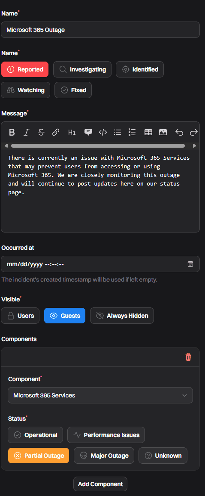
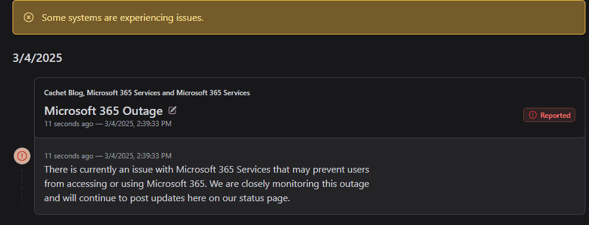

Over the weekend (on 3/1 to be exact), there was a [significant outage at Microsoft](https://www.bleepingcomputer.com/news/microsoft/microsoft-links-recent-microsoft-365-outage-to-buggy-update/) impacting primarily Exchange Online but also some other services. Even though this outage was relatively short, many MSPs reported receiving lots of emergency calls, texts, tickets, etc. With that in mind, have you thought about how you communicate outages to users when they can't receive email? Email is often our primary communication method, so it stings bad when it goes down. With that in mind, we need a central place to go to look for information.

## Enter The Status Page

Status pages are super popular for [SaaS platforms](https://status.pax8.com/) and [cloud providers](https://status.cloud.microsoft/). However, you could easily adopt a status page for your own operations that enables streamlined communications to your clients when something isn't right.

### Status Page Options

Because of the popularity of status pages, the market has blown up with a bunch of vendors wanting to get their hat in the ring. Here are a few products to consider.

- [**Atlassian Statuspage**](https://www.atlassian.com/software/statuspage/pricing). Statuspage was the original overpriced status page tool, but the prices have become a little less crazy over time. It provides a wide array of options for "components" and manually updated statuses.
- [**Better Uptime**](https://betterstack.com/uptime). Better Uptime provides a great option for simple status pages based on monitors. From what I can tell, this tool doesn't allow you to have custom statuses, which may get tricky when trying to communicate an issue with your phone system or a cloud service.
- **Self-Hosted: [Cachet](https://cachethq.io/).** Cachet is a self-hosted and open-source status page tool that seems to check all the boxes. Of course, with self-hosting, be aware of all the important variables (like patching).

## Using Your Status Page

Your status page can become a central place for letting your clients know when something is up. Training your users to go to status\[.\]coolmsp\[.\]com can give users a place to go to get updates and perhaps defer some of those tickets. At the very least, the incidents on your status page can become a reference to which you send folks.

For example, let's say there's a Microsoft 365 incident that your users are feeling. You can update your status page accordingly to let users know something is up:

\[caption id="attachment\_1925" align="aligncenter" width="398"\] Example incident using Cachet\[/caption\]

Now, you have a clean page that users can check for problems:

\[caption id="attachment\_1927" align="aligncenter" width="817"\] An active demo incident on a Cachet status page\[/caption\]

Being able to route users to a central place to get information has a myriad of benefits but, perhaps most importantly, **it should work when email doesn't.** Additionally, you can have a central place where one message is broadcast. This helps prevent the issue of your team all saying different things when they get a call about a major issue.

## Summary

At some point, inevitably, you are going to be unable to reach your client(s) through tradition means. Part of resiliency planning is being able to account for these scenarios and deal with them as they come. A simple status page can provide an easy way to communicate with your clients.
