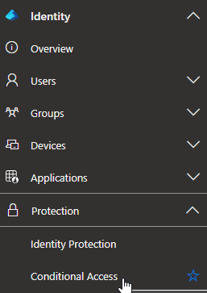
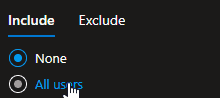
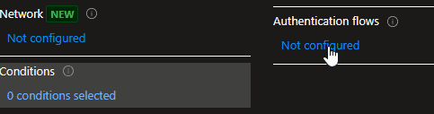
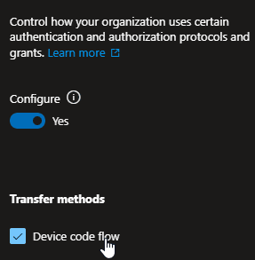
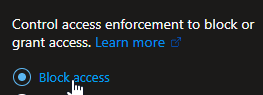
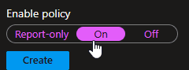

Device code phishing is a real threat that often goes unmitigated. Microsoft's [recent warning](https://www.microsoft.com/en-us/security/blog/02/13/storm-2372-conducts-device-code-phishing-campaign/) that threat actor Storm-2372 is actively executing a device-code phishing campaign drives that home. If you want to learn more about device-code phishing, check out the episode of "The Game" below or perform some research. In this article, I'll talk through how you can block device code flows with Conditional Access.

\[embed\]https://www.youtube.com/watch?v=EozC9TOkB7w\[/embed\]

## A Little Context

In this article, we'll be disabling device code flow entirely, **but**, there are some legitimate uses for device code flow. This is most prominent when logging in from a device that is incapable of natural flow (such as a desk phone or legacy PowerShell module). With that in mind, you may find yourself needing to use device codes from time to time. In those scenarios, I would recommend creating an exception group.

## Let's Stop Device Code Phishing!

In order to implement this policy, you'll need **Entra ID P1 or P2,** or a bundle that includes it.

1. Head to the [Entra Admin Center](https://entra.microsoft.com) and authenticate with your favorite admin account
2. Head to **Identity -> Protection -> Conditional Access** 
3. Click "Create new policy" 
4. Give it a name, I like "Deny device code auth" 
5. I recommend assigning this policy to **All users** and, if you have an exclusion group, excluding the group 
6. For resources, select "All resources" 
7. Head over to **Conditions -> Authentication Flows** 
8. Toggle the control to "Yes" under Configure, and select "Device code flow" 
9. Head to "Grant" and then select "Block access"  
10. If you need to log for a bit to check for dependency, set the policy to **Report-only**, otherwise, set it to **on** to immediately hinder this threat. 
11. Click **Create**

That's it, Entra will no longer allow your users to authenticate with a device-code flow. If you need to temporarily allow this flow for some reason, you can temporarily flip the policy off or add the user(s) to the exclusion group. Just don't forget to **undo** the exception!

**IMPORTANT Note:** This will only stop device-code flow when signing on to Entra with a **Microsoft** device code flow. If you are using Entra as an IdP, and authenticating with device flow elsewhere (such as AWS), this **will not** stop the authentication.
