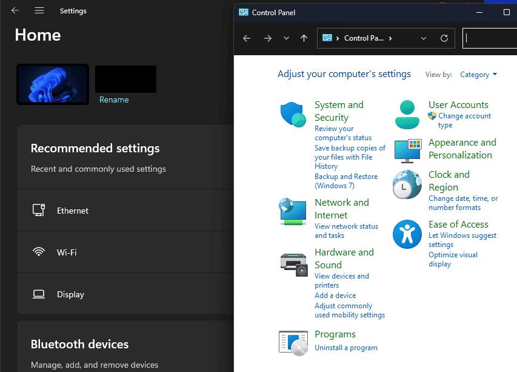

I've been a Windows user for as long as I've been a computer user for the most part. I've dabbled in Mac, used plenty of Linux distros. But, day-to-day, I still use Windows. Windows XP was the first OS I worked on professionally, alongside Server 2003. I worked on and learned Active Directories and file servers, GPO, etc. As is well known, I quickly pivoted to Azure AD (at the time), Intune, and modern device and identity management principles.

However, as a Windows user, I find myself increasingly frustrated with the experience of actually using the Operating System. Windows 7 will go down for me as my favorite Windows OS. I didn't hate Windows 10, even used 8.1 for awhile. I liked Windows 11 when it came out, but the ongoing enshittification is ruining it for me pretty rapidly. Let's talk about it. We'll primarily be talking about Windows client from here on out, I haven't worked in earnest on Windows server in some time.

## Windows has Shifted Focus

The core focus of Windows feels like it has shifted. Windows 7 was clearly purpose built to be the best desktop OS Microsoft could crank out. It was laser focused on the user experience, making things easier to use, broad compatibility, and a lot of flexibility. Manageability was there through traditional means (AD and GPO), and the consumer experience was pretty great as well.

Windows 8 and beyond saw a shift to more cloud mentalities, which makes total sense. I actually didn't hate the idea of attaching a Microsoft account for a personal PC at the time. Many did, and they could simply opt out of doing that until Windows 11 came about.

Windows 10 and the subsequent growth of Intune and Azure AD brought us true cloud management, which is where I made one of the most critical pivots of my most technical career. Cutting servers out, shifting to modern device and identity management, and creating full cloud based ecosystems was a big part of my project work, and I was one of the few doing it at the time for SMB.

However, at the same time, Windows got heavier, and more complicated. Builtin adware came about at this time. The insistence of the Xbox app (and some system dependencies on it), more background processes, and the loss of some ability to turn down visual effects to maximize performance. We found ourselves cobbling scripts together to remove junk bloatware and entire communities were creating around bringing Windows back to what it should be.

Put simply, the **focus shifted from being the OS people want to use to being an OS that drives additional revenue opportunities back to Microsoft, and gets used for relative familiarity and vendor lock in.** It had evolved in such a way that put a lot of burden on those trying to manage it and reduce the product pushing. Consumer users are largely just... stuck with it (unless they know how to get rid of it). Advertisements for Microsoft 365 subs, pre-installed games, the list goes on.

## Microsoft has Shifted Focus

Microsoft became a true cloud company through all this time (between Windows 7 and 8.1ish). That's a great thing, the Microsoft cloud ecosystem powers a lot of business. While a lot of "incompleteness" is felt throughout the suite (looking at you, Teams), Microsoft 365 is the de facto standard for running a business. Google struggles to compete with the company that made the dominant business email platform and core Office suite for decades. Everyone else "just exists."

But this also represents a real shift in priority for the company as well. Windows doesn't get the same attention it used to, at least based on my perception. It's less about "how do we make Windows the best UX" and more about "how do we make Windows drive additional cloud (and now AI) consumption." Again, for those willing to think in a new way, it provides a lot of opportunity in the IT space to drive modern solutions. Native OneDrive is a great example of this, it's really easy to enable users to access the files they need in a new and modern way - _after_ you've gotten over the hump of actually modernizing (not just migrating) that data ecosystem.

All told, it really didn't have to be a bad shift. Empower companies and users to leverage modern platforms by making it easy, and empower IT and partner ecosystems to drive that transformation. It's created a **lot** of growth and change for Microsoft and its ecosystem. However, I believe Microsoft really messed it up. This growth and change came _at the expense_ of Windows being the best UX you could get on a PC.

_Anecdote: I'm not talking about Windows 11 hardware requirements. TPM is a very valid requirement, Secure Boot is an essential item in mass markets (in my opinion)._

## So, What's Wrong With It?

In my opinion, a few key things:

- **Form over function**

****

Doing "regular Windows stuff" has become increasingly a challenge. Not because it doesn't work per se, but because it's just harder to do. For example, we're almost four years into Windows 11, and still stuck navigating between the "new Settings app" and the Control Panel depending on the task. The new stuff looks pretty, but it doesn't necessarily _work well_ yet.

For those that don't use or understand hotkeys or other shortcuts, it's getting increasingly difficult to navigate as well. When Search was a powerful function, this was less of an issue. Click Start, type the thing. However, the quality of search has been eaten away at by degrading performance and a mix of online results, even when typing an exact match for an app or file on the device. These things make it more difficult to just "use the computer."

- **General bloat**

Windows is a **heavy** operating system. Out of the box, it just has a lot going on. Much of it you may not need, but it's there nonetheless. This means that, as you load the tools you need, you very quickly make a resource hungry machine.

- **Broken app ecosystem**

The Microsoft Store still isn't a respected institution. Introduced as the Windows Store in 2012 with Windows 8 and, almost 13 years later, it's still not the first place you look when you want software. Even worse, in an attempt to drive more adoption, a lot of Microsoft Store apps are really just traditional apps that are silently installed by the Microsoft Store. If Microsoft wants to be taken serious, they need more "serious" adoption of their modern UWP app frameworks and store. Right now, it's just a pain. I don't see this improving a lot either given the rise of browser-based applications and progressive web apps. We're back to browser wars.

- **Product pushing**

This one really grinds my gears but, to be fair, others do it as well. Personally, I actually like and use the Edge browser as my daily driver. However, I wholly understand I'm the minority in that. Even when someone has opted for a different default browser (such as Chrome), Windows insists on opening some things in Edge. This is a frustrating jarring user experience, especially when you have Chrome dialed in exactly how you like it. **But**, you used Edge! Yay, one more user for the count. This problem really materializes when a company has opted for an "enterprise browser" strategy. At work, we use a managed browser product and its my default browser on my work PC. When Windows forces a thing into Edge, it could be a policy violation and Conditional Access may block me. I know what the exact problem is, and switch browsers, but it's annoying! It's more annoying for end users who don't know what's going on and the help desks that support them.

There are also _plenty_ of users, especially in the consumer space, that don't need Office. They either use the Office web apps or Google Docs, or something similar. The browser is king for them (and increasingly for all of us). But, if you aren't a Microsoft 365 subscriber, Windows will be sure to remind you frequently of your violation of Microsoft's common sense. We needn't address built in bloat, we know why it sucks, but it's still there.

- **ARM is a mess**

The aforementioned bloat came with serious issues, especially for people on the go. It's just hard to have x86 under that much load and have good performance and battery life. For this reason, I was **pumped** about Windows on ARM. ARM devices have wicked good battery life and performance profiles for "general purpose" computer users. However, the execution has been less than stellar. I'm _just now_ seeing users move to ARM devices and be happy about it. And that's largely a result of a failure that plagued Windows Phone back in the day, the app ecosystem sucks. There just aren't enough ARM apps to drive a great experience for Windows on ARM, instead sticking users with emulated x86 that will never be a great experience. This had led to fewer manufacturers putting Snapdragon chips in their devices, sticking with trusty Intel and AMD so they can continue to sell into competitive markets that use these apps.

## The Robotic Elephant in the Room: Copilot

I really like Copilot, truthfully. The core features of Copilot for M365 have become a part of my normal work routine. Helping me book calls (well, kind of), prioritize emails, summarize emails, write better emails and documents, the almighty meeting recap, the list goes on. These things are amazing. **However**, I use Copilot when I need Copilot. If I'm not using it, it is just a thing that's in the way.

The problem here is that Copilot is **EVERYWHERE**. It's like 7 clicks to get Copilot of of your taskbar. I don't need to use Copilot for everything, I need to use it when I need it to do something. Microsoft's core product goal, seemingly in every product at this point, seems to be to get you to click the rainbow icon to ask Copilot about what you're doing. And, candidly, it's fucking annoying.

The root problem here may be Copilot itself. For all of its strengths, when I find myself needing to do "real AI" work with nonsensitive data, I immediately flock over to OpenAI ChatGPT, Anthropic Claude, or more recently even Google Gemini, all of which perform better when I ask them to do or find something more bespoke. This, for me, makes the Copilot buttons everywhere a little more annoying. I'm a huge Copilot fan, but I also see value in using the best tool for the job at hand. And Copilot being in my face all the time just adds a layer of annoyance to the product for me.

And then there's Recall. Since the Metro experience on non-touch devices, I can't think of a more annoying product push. I don't trust it, I don't want it. Copilot should be there when I need it, not there when Microsoft wants it there. All the other things above I can live with and work around, Recall is likely to be the final straw for me.

## Where to from here?

For all of this, I still find myself ridiculously nervous to move away from Windows. It's _just familiar enough_ that I can sit at any Windows PC and get to work, even if I'm annoyed by it. I've dabbled in Linux distros and find myself reinstalling Windows within a month or two for convenience. For that reason, I think Microsoft remains in a relatively "safe" position for maintaining its core user base, for now. They've found a line where they can be incredibly annoying, but not annoying enough to force mainstream corporate away from it en masse. However, I do believe decisions like Recall are going to erode their user base over time, especially in the consumer space (and as gaming becomes more and more flexible).

It's also worth noting that Microsoft lost virtually the entire K-12 ecosystem on the desktop, and this is creating generations of kids who will be used to a ChromeOS type of experience. Google's decision to use the Android kernel and base OS to replace ChromeOS is also a threat. Android is SUPER manageable in the Microsoft ecosystem, and this is very likely to materialize into some interesting, enterprise-ready "Android laptops" in the future. As apps become less important than great browsing experiences, the core dependencies that drive corporate to Windows will erode.

Threats like the increased adoption of Mac for work, Android laptops, and other innovations sure to come also threaten Microsoft's Azure business. If Windows isn't the OS of choice, there's no way we're going to sell Windows 365 or it's legacy cousin Azure Virtual Desktop. As work moves to the web, the dependence on NT deteriorates and there just won't be a need to have a ready Windows desktop.

So for me personally, I'll probably make a move soon when I decide to commit to it (it's probably going to be Mac). But for work, I'll probably use Windows for a long time to come, because I'm most comfortable _working_ in Windows (and fully capable of getting rid of a lot of the annoying parts). But who knows, once I get through the trauma of switching operating systems, I might just make the switch there to.

## Conclusion

This got longer than I anticipated, maybe a little ranty. But hopefully I've made the point. In my opinion, Microsoft is neglecting what made it Microsoft. If they don't address it soon, I feel confident making a projection that Microsoft will bleed their share of enterprise desktop over time, which will _seriously_ compromise their ability to put things like Copilot front and center. And no, I don't think the Linux desktop is upon us, sorry. I think Apple and, surprisingly, Google will benefit.

_Anecdote: I'm actually eager for the first inexpensive Android laptop to drop, I fully intend to buy one to play with. An inexpensive, fully MDM ready laptop with the Android ecosystem seems pretty cool_.

But who knows, maybe this is the plan. Microsoft is pivoting to be a [datacenter company](https://www.cnbc.com/2024/09/24/microsoft-to-spend-1point3-billion-in-mexico-on-cloud-ai-tech.html) to power the AI frontier. It's a great strategy, win on infrastructure. Build [entire nuclear reactors](https://www.npr.org/2024/09/20/nx-s1-5120581/three-mile-island-nuclear-power-plant-microsoft-ai) worth of compute, and win revenue whether or not it's your AI product being used. However, I can't help but think this is going to cost them their operating system dominance.
